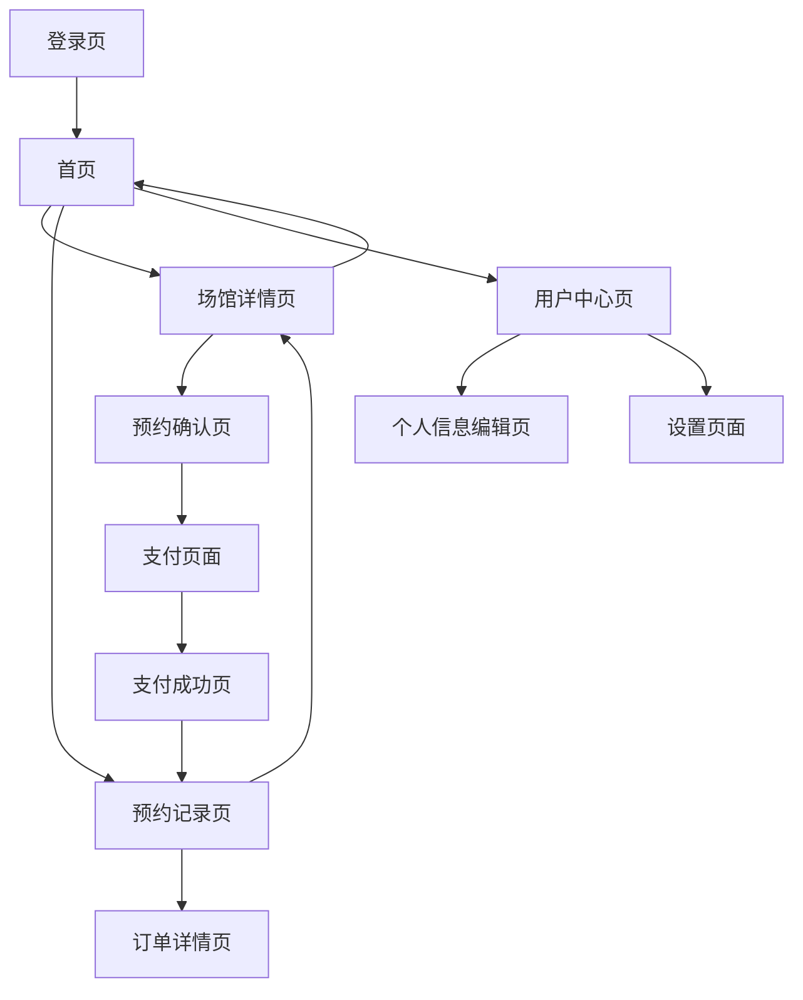

# 体育馆预约系统产品需求文档

## 1. 产品概述

体育馆预约系统是一款基于微信小程序的场馆预约平台，用户可以通过小程序查看场馆信息、选择时间段并完成预约和支付。系统支持多种场馆类型（篮球场、羽毛球场、乒乓球场等），提供实时的时间段状态更新和便捷的预约流程。

该系统解决了传统场馆预约需要电话或现场预约的不便，为用户提供24小时在线预约服务，同时为场馆管理方提供高效的预约管理和收益统计功能。目标是成为本地领先的体育场馆预约平台，提升场馆利用率和用户体验。

## 2. 核心功能

### 2.1 用户角色

| 角色    | 注册方式    | 核心权限                     |
| ----- | ------- | ------------------------ |
| 普通用户  | 微信授权登录  | 浏览场馆、预约时间段、查看预约记录、支付订单   |
| 场馆管理员 | 后台账号分配  | 管理场馆信息、生成时间段、查看预约统计、处理退款 |
| 系统管理员 | 超级管理员分配 | 用户管理、场馆管理、系统配置、数据统计      |

### 2.2 功能模块

本体育馆预约系统包含以下主要页面：

1. **首页**: 场馆展示区、快速预约入口、用户导航菜单
2. **场馆详情页**: 场馆信息展示、时间段选择器、预约操作区
3. **预约确认页**: 预约信息确认、联系方式填写、支付功能
4. **预约记录页**: 历史预约列表、订单状态查看、取消/退款操作
5. **用户中心页**: 个人信息管理、设置选项、客服联系
6. **登录页**: 微信授权登录、用户协议展示

### 2.3 页面详情

| 页面名称  | 模块名称    | 功能描述                                |
| ----- | ------- | ----------------------------------- |
| 首页    | 场馆展示区   | 展示热门场馆卡片，包含场馆图片、名称、价格、评分信息，支持横向滑动浏览 |
| 首页    | 快速预约入口  | 提供日期选择器和场馆类型筛选，快速跳转到对应场馆的预约页面       |
| 首页    | 导航菜单    | 底部导航栏，包含首页、预约记录、用户中心等主要功能入口         |
| 场馆详情页 | 场馆信息展示  | 显示场馆详细信息：名称、图片轮播、位置、设施介绍、营业时间、价格说明  |
| 场馆详情页 | 时间段选择器  | 日期选择器和时间段网格，实时显示可用、已占用、维护中三种状态，支持多选 |
| 场馆详情页 | 预约操作区   | 显示选中时间段信息、总价计算、预约按钮，处理预约逻辑和状态反馈     |
| 预约确认页 | 预约信息确认  | 展示场馆信息、选中时间段、价格明细，允许用户最后确认          |
| 预约确认页 | 联系方式填写  | 手机号输入框、备注信息输入，表单验证和提交               |
| 预约确认页 | 支付功能    | 集成微信支付，显示支付金额、支付方式选择、支付状态处理         |
| 预约记录页 | 历史预约列表  | 按时间倒序显示预约记录，包含场馆、时间、状态、金额等信息        |
| 预约记录页 | 订单状态查看  | 显示订单详细状态：待支付、已支付、已完成、已取消、已退款        |
| 预约记录页 | 取消/退款操作 | 根据预约状态提供取消预约、申请退款功能，处理退款流程          |
| 用户中心页 | 个人信息管理  | 显示用户头像、昵称、手机号，支持信息编辑和头像更换           |
| 用户中心页 | 设置选项    | 通知设置、隐私设置、关于我们、意见反馈等功能入口            |
| 用户中心页 | 客服联系    | 在线客服入口、客服电话、常见问题解答                  |
| 登录页   | 微信授权登录  | 微信一键登录按钮、获取用户基本信息、处理登录状态            |
| 登录页   | 用户协议展示  | 用户协议和隐私政策链接、同意条款复选框                 |

## 3. 核心流程

### 3.1 用户预约流程

用户通过以下步骤完成场馆预约：

1. 微信授权登录系统
2. 浏览首页场馆列表或使用快速预约功能
3. 选择目标场馆进入详情页
4. 选择预约日期和时间段
5. 点击预约按钮进入确认页
6. 填写联系信息和备注
7. 确认预约信息并发起支付
8. 完成微信支付
9. 查看预约成功页面和预约记录

### 3.2 管理员操作流程

场馆管理员的主要操作流程：

1. 登录管理后台系统
2. 管理场馆基本信息和图片
3. 设置场馆营业时间和价格
4. 生成未来时间段或批量生成
5. 查看和处理用户预约
6. 处理特殊情况（维护、取消等）
7. 查看收益统计和预约报表

### 3.3 页面导航流程图

## 4. 用户界面设计

### 4.1 设计风格

**主色调**：

* 主色：#1890FF（蓝色）- 代表专业和信任

* 辅助色：#52C41A（绿色）- 代表可用状态

* 警告色：#FAAD14（橙色）- 代表维护状态

* 错误色：#F5222D（红色）- 代表占用状态

* 背景色：#F5F5F5（浅灰）- 整体背景

**按钮样式**：

* 主要按钮：圆角8px，渐变蓝色背景，白色文字

* 次要按钮：圆角8px，白色背景，蓝色边框和文字

* 禁用按钮：圆角8px，灰色背景，深灰文字

**字体规范**：

* 主标题：18px，加粗，深灰色 #262626

* 副标题：16px，中等，深灰色 #595959

* 正文：14px，常规，灰色 #8C8C8C

* 小字：12px，常规，浅灰 #BFBFBF

**布局风格**：

* 卡片式设计，圆角12px，阴影效果

* 顶部导航栏固定，底部标签栏导航

* 16px页面边距，12px组件间距

* 网格布局用于时间段选择

**图标样式**：

* 使用线性图标风格，1.5px线宽

* 统一24px尺寸，支持主题色彩

* 常用图标：时钟、位置、电话、支付、用户等

### 4.2 页面设计概览

| 页面名称  | 模块名称    | UI元素                                                               |
| ----- | ------- | ------------------------------------------------------------------ |
| 首页    | 场馆展示区   | 横向滚动卡片列表，每个卡片包含场馆图片(16:9比例)、名称(16px加粗)、价格标签(橙色背景)、评分星级，卡片阴影效果和圆角设计 |
| 首页    | 快速预约入口  | 顶部搜索栏样式，包含日期选择器(日历图标)、场馆类型下拉选择(筛选图标)、搜索按钮(蓝色渐变)，整体白色背景圆角设计         |
| 首页    | 导航菜单    | 底部固定标签栏，4个主要入口：首页、预约、记录、我的，选中状态蓝色高亮，未选中灰色，图标+文字组合                  |
| 场馆详情页 | 场馆信息展示  | 顶部轮播图(全屏宽度)、场馆名称(20px加粗)、位置信息(位置图标+地址)、设施标签(圆角标签样式)、营业时间和价格信息卡片    |
| 场馆详情页 | 时间段选择器  | 日期横向滑动选择器(当天高亮)、时间段网格布局(3列)，可用状态绿色边框、占用状态红色背景、维护状态橙色背景，选中状态蓝色高亮    |
| 场馆详情页 | 预约操作区   | 底部固定操作栏，左侧显示选中时间段和总价(16px加粗)，右侧预约按钮(蓝色渐变，圆角)，包含加载状态和禁用状态样式         |
| 预约确认页 | 预约信息确认  | 信息卡片布局，场馆图片(小尺寸)、名称、时间段列表、价格明细表格，整体白色背景圆角卡片，分割线区分不同信息块             |
| 预约确认页 | 联系方式填写  | 表单样式，手机号输入框(数字键盘)、备注多行文本框，输入框圆角边框，聚焦状态蓝色边框，错误状态红色边框和提示文字           |
| 预约确认页 | 支付功能    | 支付金额大字号显示(24px加粗)、微信支付图标和文字、支付按钮(绿色背景)，支付中状态显示加载动画，支付成功显示勾选动画      |
| 预约记录页 | 历史预约列表  | 列表项卡片设计，左侧场馆图片(圆角)、中间信息(场馆名、时间、状态)、右侧价格和操作按钮，状态标签不同颜色区分，支持下拉刷新     |
| 预约记录页 | 订单状态查看  | 状态时间轴设计，不同状态节点用不同颜色圆点表示，当前状态高亮显示，包含状态说明文字和时间信息                     |
| 预约记录页 | 取消/退款操作 | 操作按钮根据状态动态显示，取消按钮(红色边框)、退款按钮(橙色边框)，操作确认弹窗，包含操作说明和确认/取消按钮           |
| 用户中心页 | 个人信息管理  | 顶部用户信息卡片，头像(圆形，支持点击更换)、昵称和手机号显示，编辑按钮(铅笔图标)，信息项列表样式，右箭头指示可点击        |
| 用户中心页 | 设置选项    | 设置项列表，每项包含图标、标题、描述(可选)、右箭头，开关类设置显示切换按钮，分组显示不同类型设置                  |
| 用户中心页 | 客服联系    | 客服卡片，客服头像、在线状态指示、联系方式，快速联系按钮(电话图标+微信图标)，常见问题折叠列表                   |
| 登录页   | 微信授权登录  | 居中布局，应用Logo和名称、欢迎文字、微信登录按钮(微信绿色，圆角)，登录按钮包含微信图标和"微信快速登录"文字          |
| 登录页   | 用户协议展示  | 页面底部协议链接，复选框+协议文字，协议文字可点击跳转，未同意状态登录按钮禁用，协议页面支持滚动查看                 |

### 4.3 响应式设计

本系统主要面向微信小程序平台，采用移动端优先的响应式设计：

**屏幕适配**：

* 主要适配iPhone和Android主流屏幕尺寸

* 支持竖屏和横屏切换（部分页面）

* 使用rpx单位确保不同设备的一致性

**触摸交互优化**：

* 按钮最小点击区域44px×44px

* 支持长按、滑动、双击等手势

* 提供触觉反馈和视觉反馈

* 优化滚动性能和滑动体验

**性能优化**：

* 图片懒加载和压缩

* 组件按需加载

* 缓存策略优化

* 网络请求优化

**无障碍支持**：

* 支持屏幕阅读器

* 合理的颜色对比度

* 清晰的操作反馈

* 键盘导航支持

