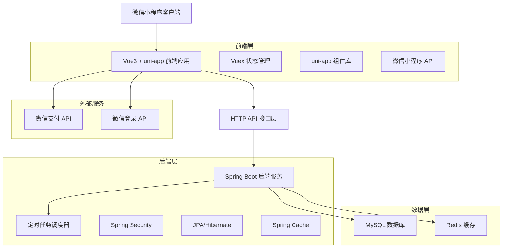
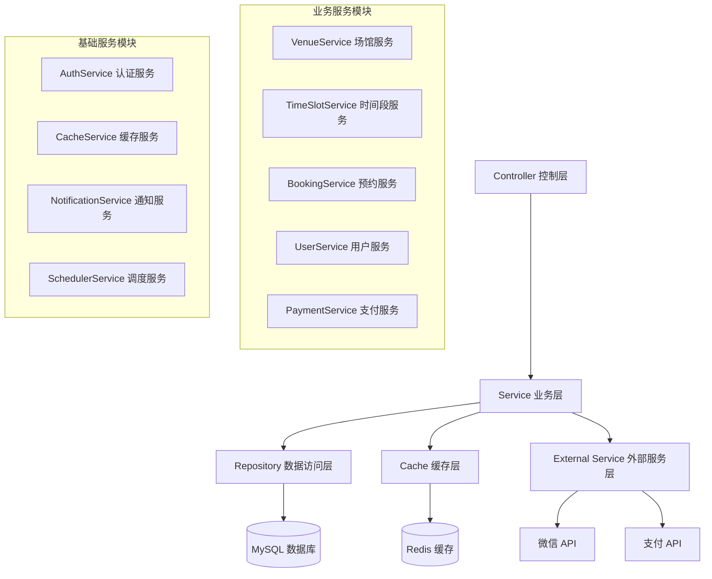
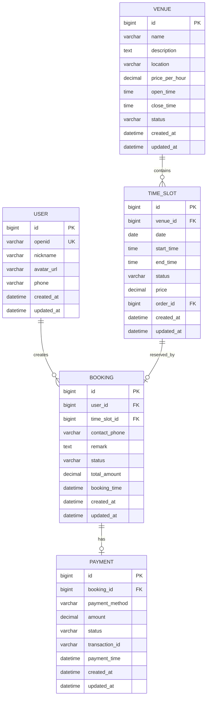

# 体育馆预约系统技术架构文档

## 1. 架构设计



## 2. 技术描述

### 2.1 前端技术栈

* **框架**: Vue3 + uni-app

* **开发工具**: HBuilderX + 微信开发者工具

* **状态管理**: Vuex 4.x

* **UI组件**: uni-ui + 自定义组件

* **网络请求**: uni.request + 封装的 HTTP 客户端

* **缓存**: uni.setStorage + 内存缓存

### 2.2 后端技术栈

* **框架**: Spring Boot 2.x

* **数据库**: MySQL 8.0

* **ORM**: Spring Data JPA + Hibernate

* **缓存**: Redis + Spring Cache

* **安全**: Spring Security

* **定时任务**: Spring Task Scheduler

* **API文档**: Swagger/OpenAPI

### 2.3 部署环境

* **服务器**: Linux/CentOS

* **应用服务器**: 内置 Tomcat

* **数据库**: MySQL 8.0

* **缓存**: Redis 6.x

* **反向代理**: Nginx

## 3. 路由定义

### 3.1 前端路由

| 路由                     | 页面名称  | 功能描述               |
| ---------------------- | ----- | ------------------ |
| /pages/index/index     | 首页    | 展示场馆列表，用户可以浏览和选择场馆 |
| /pages/venue/detail    | 场馆详情页 | 显示场馆信息、时间段列表和预约功能  |
| /pages/booking/confirm | 预约确认页 | 确认预约信息和支付          |
| /pages/booking/list    | 预约记录页 | 显示用户的预约历史和状态       |
| /pages/user/profile    | 用户中心  | 用户信息管理和设置          |
| /pages/login/index     | 登录页   | 微信授权登录             |

### 3.2 后端路由

| 路由                  | 功能描述     |
| ------------------- | -------- |
| /api/auth/\*\*      | 用户认证相关接口 |
| /api/venues/\*\*    | 场馆管理接口   |
| /api/timeslots/\*\* | 时间段管理接口  |
| /api/bookings/\*\*  | 预约管理接口   |
| /api/users/\*\*     | 用户管理接口   |
| /api/payments/\*\*  | 支付相关接口   |

## 4. API 定义

### 4.1 核心 API

#### 4.1.1 时间段管理 API

**获取场馆时间段**

```
GET /api/timeslots/venue/{venueId}/date/{date}
```

请求参数:

| 参数名          | 参数类型    | 是否必需  | 描述              |
| ------------ | ------- | ----- | --------------- |
| venueId      | Long    | true  | 场馆ID            |
| date         | String  | true  | 日期 (yyyy-MM-dd) |
| forceRefresh | Boolean | false | 是否强制刷新缓存        |

响应格式:

| 字段名       | 字段类型    | 描述     |
| --------- | ------- | ------ |
| success   | Boolean | 请求是否成功 |
| message   | String  | 响应消息   |
| data      | Array   | 时间段列表  |
| timestamp | Long    | 响应时间戳  |
| count     | Integer | 数据条数   |

响应示例:

```json
{
  "success": true,
  "message": "获取成功",
  "data": [
    {
      "id": 1,
      "venueId": 1,
      "date": "2024-01-15",
      "startTime": "09:00",
      "endTime": "10:00",
      "status": "AVAILABLE",
      "price": 100.00,
      "orderId": null
    }
  ],
  "timestamp": 1705123456789,
  "count": 1
}
```

**创建预约**

```
POST /api/bookings
```

请求体:

| 字段名          | 字段类型   | 是否必需  | 描述    |
| ------------ | ------ | ----- | ----- |
| timeSlotId   | Long   | true  | 时间段ID |
| userId       | Long   | true  | 用户ID  |
| contactPhone | String | true  | 联系电话  |
| remark       | String | false | 备注信息  |

响应格式:

| 字段名     | 字段类型    | 描述     |
| ------- | ------- | ------ |
| success | Boolean | 预约是否成功 |
| message | String  | 响应消息   |
| data    | Object  | 预约信息   |

#### 4.1.2 用户认证 API

**微信登录**

```
POST /api/auth/wechat/login
```

请求体:

| 字段名      | 字段类型   | 是否必需  | 描述    |
| -------- | ------ | ----- | ----- |
| code     | String | true  | 微信授权码 |
| userInfo | Object | false | 用户信息  |

响应格式:

| 字段名     | 字段类型    | 描述         |
| ------- | ------- | ---------- |
| success | Boolean | 登录是否成功     |
| message | String  | 响应消息       |
| data    | Object  | 用户信息和token |

## 5. 服务架构图



## 6. 数据模型

### 6.1 数据模型定义



### 6.2 数据定义语言

#### 用户表 (users)

```sql
-- 创建用户表
CREATE TABLE users (
    id BIGINT PRIMARY KEY AUTO_INCREMENT,
    openid VARCHAR(64) UNIQUE NOT NULL COMMENT '微信openid',
    nickname VARCHAR(100) COMMENT '用户昵称',
    avatar_url VARCHAR(500) COMMENT '头像URL',
    phone VARCHAR(20) COMMENT '手机号',
    created_at DATETIME DEFAULT CURRENT_TIMESTAMP,
    updated_at DATETIME DEFAULT CURRENT_TIMESTAMP ON UPDATE CURRENT_TIMESTAMP
);

-- 创建索引
CREATE INDEX idx_users_openid ON users(openid);
CREATE INDEX idx_users_phone ON users(phone);
```

#### 场馆表 (venues)

```sql
-- 创建场馆表
CREATE TABLE venues (
    id BIGINT PRIMARY KEY AUTO_INCREMENT,
    name VARCHAR(100) NOT NULL COMMENT '场馆名称',
    description TEXT COMMENT '场馆描述',
    location VARCHAR(200) COMMENT '场馆位置',
    price_per_hour DECIMAL(10,2) DEFAULT 0.00 COMMENT '每小时价格',
    open_time TIME DEFAULT '08:00:00' COMMENT '开放时间',
    close_time TIME DEFAULT '22:00:00' COMMENT '关闭时间',
    status VARCHAR(20) DEFAULT 'ACTIVE' COMMENT '状态',
    created_at DATETIME DEFAULT CURRENT_TIMESTAMP,
    updated_at DATETIME DEFAULT CURRENT_TIMESTAMP ON UPDATE CURRENT_TIMESTAMP
);

-- 创建索引
CREATE INDEX idx_venues_status ON venues(status);
```

#### 时间段表 (time\_slots)

```sql
-- 创建时间段表
CREATE TABLE time_slots (
    id BIGINT PRIMARY KEY AUTO_INCREMENT,
    venue_id BIGINT NOT NULL COMMENT '场馆ID',
    date DATE NOT NULL COMMENT '日期',
    start_time TIME NOT NULL COMMENT '开始时间',
    end_time TIME NOT NULL COMMENT '结束时间',
    status VARCHAR(20) DEFAULT 'AVAILABLE' COMMENT '状态',
    price DECIMAL(10,2) DEFAULT 0.00 COMMENT '价格',
    order_id BIGINT COMMENT '预约订单ID',
    created_at DATETIME DEFAULT CURRENT_TIMESTAMP,
    updated_at DATETIME DEFAULT CURRENT_TIMESTAMP ON UPDATE CURRENT_TIMESTAMP,
    
    FOREIGN KEY (venue_id) REFERENCES venues(id),
    UNIQUE KEY uk_venue_date_time (venue_id, date, start_time)
);

-- 创建索引
CREATE INDEX idx_timeslot_venue_date_time ON time_slots(venue_id, date, start_time);
CREATE INDEX idx_timeslot_status_date ON time_slots(status, date);
CREATE INDEX idx_timeslot_updated_at ON time_slots(updated_at);
```

#### 预约表 (bookings)

```sql
-- 创建预约表
CREATE TABLE bookings (
    id BIGINT PRIMARY KEY AUTO_INCREMENT,
    user_id BIGINT NOT NULL COMMENT '用户ID',
    time_slot_id BIGINT NOT NULL COMMENT '时间段ID',
    contact_phone VARCHAR(20) NOT NULL COMMENT '联系电话',
    remark TEXT COMMENT '备注',
    status VARCHAR(20) DEFAULT 'PENDING' COMMENT '状态',
    total_amount DECIMAL(10,2) DEFAULT 0.00 COMMENT '总金额',
    booking_time DATETIME DEFAULT CURRENT_TIMESTAMP COMMENT '预约时间',
    created_at DATETIME DEFAULT CURRENT_TIMESTAMP,
    updated_at DATETIME DEFAULT CURRENT_TIMESTAMP ON UPDATE CURRENT_TIMESTAMP,
    
    FOREIGN KEY (user_id) REFERENCES users(id),
    FOREIGN KEY (time_slot_id) REFERENCES time_slots(id)
);

-- 创建索引
CREATE INDEX idx_bookings_user_id ON bookings(user_id);
CREATE INDEX idx_bookings_time_slot_id ON bookings(time_slot_id);
CREATE INDEX idx_bookings_status ON bookings(status);
CREATE INDEX idx_bookings_booking_time ON bookings(booking_time);
```

#### 支付表 (payments)

```sql
-- 创建支付表
CREATE TABLE payments (
    id BIGINT PRIMARY KEY AUTO_INCREMENT,
    booking_id BIGINT NOT NULL COMMENT '预约ID',
    payment_method VARCHAR(20) DEFAULT 'WECHAT' COMMENT '支付方式',
    amount DECIMAL(10,2) NOT NULL COMMENT '支付金额',
    status VARCHAR(20) DEFAULT 'PENDING' COMMENT '支付状态',
    transaction_id VARCHAR(100) COMMENT '交易ID',
    payment_time DATETIME COMMENT '支付时间',
    created_at DATETIME DEFAULT CURRENT_TIMESTAMP,
    updated_at DATETIME DEFAULT CURRENT_TIMESTAMP ON UPDATE CURRENT_TIMESTAMP,
    
    FOREIGN KEY (booking_id) REFERENCES bookings(id)
);

-- 创建索引
CREATE INDEX idx_payments_booking_id ON payments(booking_id);
CREATE INDEX idx_payments_transaction_id ON payments(transaction_id);
CREATE INDEX idx_payments_status ON payments(status);
```

#### 初始化数据

```sql
-- 插入示例场馆数据
INSERT INTO venues (name, description, location, price_per_hour, open_time, close_time) VALUES
('篮球场A', '标准篮球场，设施完善', '体育馆1楼', 100.00, '08:00:00', '22:00:00'),
('羽毛球场B', '专业羽毛球场地', '体育馆2楼', 80.00, '08:00:00', '22:00:00'),
('乒乓球场C', '乒乓球训练场地', '体育馆3楼', 60.00, '08:00:00', '22:00:00');

-- 插入示例用户数据
INSERT INTO users (openid, nickname, phone) VALUES
('test_openid_001', '测试用户1', '13800138001'),
('test_openid_002', '测试用户2', '13800138002');
```

## 7. 系统特性

### 7.1 性能特性

* **响应时间**: API响应时间 < 500ms

* **并发处理**: 支持1000+并发用户

* **缓存策略**: 多层缓存提升性能

* **数据库优化**: 索引优化和查询优化

### 7.2 可靠性特性

* **事务管理**: 确保数据一致性

* **错误处理**: 完善的异常处理机制

* **日志记录**: 详细的操作日志

* **监控告警**: 系统状态监控

### 7.3 安全特性

* **身份认证**: 微信OAuth2.0认证

* **数据加密**: 敏感数据加密存储

* **接口安全**: API访问控制

* **SQL注入防护**: 参数化查询

### 7.4 扩展特性

* **模块化设计**: 便于功能扩展

* **配置化管理**: 灵活的配置管理

* **插件机制**: 支持功能插件

* **API版本控制**: 向后兼容性保证

