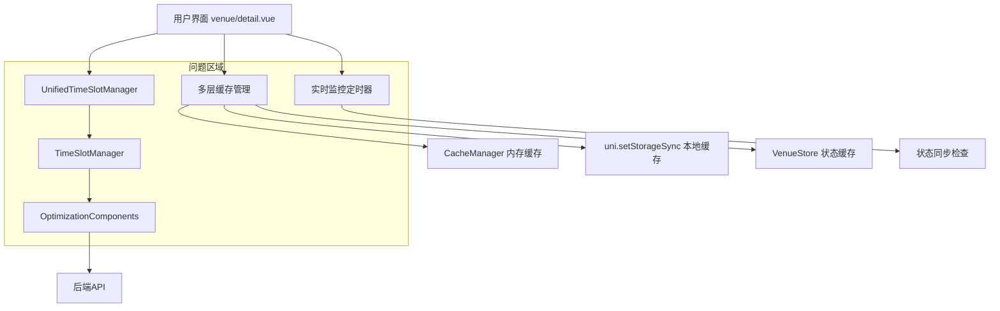
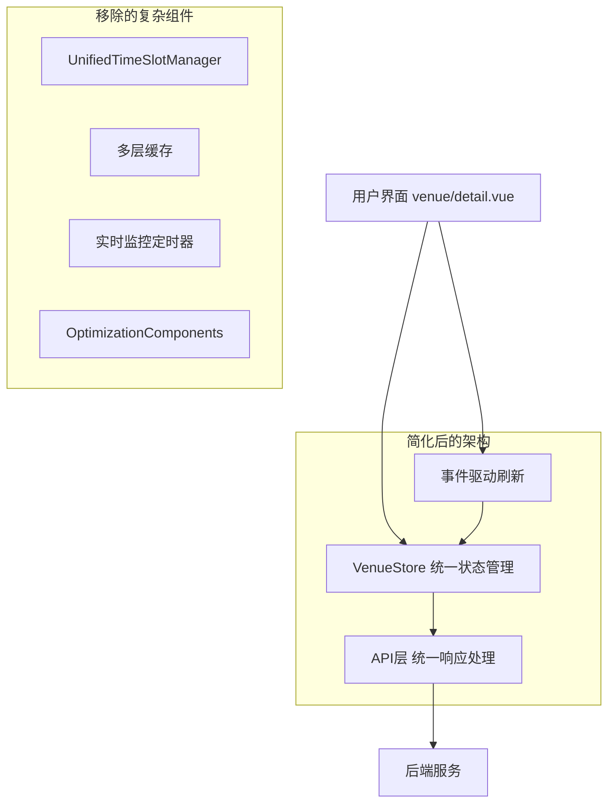

# 体育馆预约系统 - 技术架构优化方案

## 1. 架构设计

### 当前架构问题



### 优化后架构



## 2. 技术描述

### 优化前技术栈

* 前端：Vue3 + uni-app + 复杂状态管理

* 缓存：多层缓存（内存+本地存储+状态缓存）

* 优化器：UnifiedTimeSlotManager + TimeSlotManager + OptimizationComponents

* 监控：实时定时器监控（30秒间隔）

### 优化后技术栈

* 前端：Vue3 + uni-app + 简化状态管理

* 缓存：VenueStore 单一状态缓存（5分钟TTL）

* 刷新：事件驱动刷新机制

* 监控：移除实时监控，改为按需刷新

## 3. 核心修改文件

| 文件路径                              | 修改类型 | 修改内容          |
| --------------------------------- | ---- | ------------- |
| stores/venue.js                   | 重构   | 简化缓存机制，统一状态管理 |
| pages/venue/detail.vue            | 重构   | 移除复杂监控，简化刷新逻辑 |
| api/venue.js                      | 优化   | 统一API响应格式处理   |
| utils/unified-timeslot-manager.js | 删除   | 移除复杂优化器       |
| utils/cache-manager.js            | 简化   | 保留基础缓存功能      |

## 4. API定义优化

### 4.1 时间段获取API

**优化前**：多种响应格式，处理复杂

```javascript
// 可能的响应格式1
{
  "data": [...timeSlots],
  "code": 200
}

// 可能的响应格式2
[...timeSlots]

// 可能的响应格式3
{
  "timeSlots": [...],
  "status": "success"
}
```

**优化后**：统一响应格式

```javascript
// 统一返回数组格式
GET /api/venue/{venueId}/timeslots?date={date}

Response:
[
  {
    "id": "slot_001",
    "startTime": "09:00",
    "endTime": "10:00",
    "status": "AVAILABLE", // AVAILABLE | OCCUPIED | MAINTENANCE
    "price": 100
  }
]
```

### 4.2 状态更新API

**新增事件通知机制**

```javascript
// 预约成功后触发事件
POST /api/booking/create

Response:
{
  "bookingId": "booking_001",
  "timeSlotIds": ["slot_001", "slot_002"],
  "status": "success"
}

// 前端监听预约成功事件，立即刷新时间段
uni.$emit('booking-success', {
  venueId: this.venueId,
  date: this.selectedDate,
  timeSlotIds: response.timeSlotIds
})
```

## 5. 数据模型优化

### 5.1 VenueStore状态结构

**优化前**：复杂的多层状态

```javascript
{
  venues: [],
  timeSlots: [],
  timeSlotsCache: Map(),
  lastRefreshTime: {},
  optimizationComponents: {},
  unifiedTimeSlotManager: {},
  // ... 更多复杂状态
}
```

**优化后**：简化的状态结构

```javascript
{
  venues: [],
  timeSlots: [],
  timeSlotsCache: Map(), // 简单的内存缓存
  loading: false,
  error: null
}
```

### 5.2 缓存数据结构

```javascript
// 缓存键值对结构
const cacheKey = `${venueId}_${date}` // 例如: "venue_001_2024-01-15"
const cacheValue = {
  data: [...timeSlots],
  timestamp: Date.now(),
  ttl: 300000 // 5分钟
}
```

## 6. 核心代码实现

### 6.1 VenueStore优化实现

```javascript
// stores/venue.js - 简化版本
export const useVenueStore = defineStore('venue', {
  state: () => ({
    venues: [],
    timeSlots: [],
    timeSlotsCache: new Map(),
    loading: false,
    error: null
  }),
  
  actions: {
    // 统一的时间段获取方法
    async getTimeSlots(venueId, date, forceRefresh = false) {
      const cacheKey = `${venueId}_${date}`
      
      // 检查缓存
      if (!forceRefresh && this.timeSlotsCache.has(cacheKey)) {
        const cached = this.timeSlotsCache.get(cacheKey)
        if (Date.now() - cached.timestamp < 300000) {
          this.timeSlots = cached.data
          return cached.data
        }
      }
      
      // 获取最新数据
      this.loading = true
      try {
        const timeSlots = await api.getVenueTimeSlots(venueId, date)
        
        // 更新缓存和状态
        this.timeSlotsCache.set(cacheKey, {
          data: timeSlots,
          timestamp: Date.now()
        })
        this.timeSlots = timeSlots
        this.error = null
        
        return timeSlots
      } catch (error) {
        this.error = error.message
        throw error
      } finally {
        this.loading = false
      }
    },
    
    // 清除指定缓存
    clearTimeSlotCache(venueId, date) {
      const cacheKey = `${venueId}_${date}`
      this.timeSlotsCache.delete(cacheKey)
    },
    
    // 预约成功后的状态更新
    onBookingSuccess(venueId, date, timeSlotIds) {
      // 立即更新本地状态
      this.timeSlots.forEach(slot => {
        if (timeSlotIds.includes(slot.id)) {
          slot.status = 'OCCUPIED'
        }
      })
      
      // 清除缓存，确保下次获取最新数据
      this.clearTimeSlotCache(venueId, date)
    }
  }
})
```

### 6.2 页面组件优化实现

```javascript
// pages/venue/detail.vue - 简化版本
export default {
  data() {
    return {
      venueId: '',
      selectedDate: '',
      loading: false
    }
  },
  
  computed: {
    timeSlots() {
      return this.venueStore.timeSlots
    }
  },
  
  methods: {
    // 简化的时间段加载
    async loadTimeSlots(forceRefresh = false) {
      if (this.loading) return
      
      try {
        await this.venueStore.getTimeSlots(
          this.venueId,
          this.selectedDate,
          forceRefresh
        )
      } catch (error) {
        uni.showToast({
          title: '加载失败，请重试',
          icon: 'none'
        })
      }
    },
    
    // 手动刷新
    async onRefresh() {
      await this.loadTimeSlots(true)
    },
    
    // 预约成功处理
    async onBookingSuccess(timeSlotIds) {
      // 立即更新状态
      this.venueStore.onBookingSuccess(
        this.venueId,
        this.selectedDate,
        timeSlotIds
      )
      
      // 显示成功提示
      uni.showToast({
        title: '预约成功',
        icon: 'success'
      })
    }
  },
  
  onLoad(options) {
    this.venueId = options.venueId
    this.selectedDate = options.date || this.getCurrentDate()
    this.loadTimeSlots()
    
    // 监听预约成功事件
    uni.$on('booking-success', this.onBookingSuccess)
  },
  
  onUnload() {
    // 清理事件监听
    uni.$off('booking-success', this.onBookingSuccess)
  }
}
```

### 6.3 API层优化实现

```javascript
// api/venue.js - 统一响应处理
import { request } from '@/utils/request'

// 获取场馆时间段
export async function getVenueTimeSlots(venueId, date) {
  try {
    const response = await request({
      url: `/venue/${venueId}/timeslots`,
      method: 'GET',
      data: { date }
    })
    
    // 统一返回数组格式
    let timeSlots = []
    if (response.data && Array.isArray(response.data)) {
      timeSlots = response.data
    } else if (Array.isArray(response)) {
      timeSlots = response
    } else if (response.timeSlots && Array.isArray(response.timeSlots)) {
      timeSlots = response.timeSlots
    }
    
    // 数据验证和标准化
    return timeSlots.filter(slot => 
      slot && slot.id && slot.startTime && slot.endTime && slot.status
    ).map(slot => ({
      id: slot.id,
      startTime: slot.startTime,
      endTime: slot.endTime,
      status: slot.status,
      price: slot.price || 0,
      available: slot.status === 'AVAILABLE'
    }))
    
  } catch (error) {
    console.error('获取时间段失败:', error)
    throw new Error('获取时间段失败，请检查网络连接')
  }
}

// 创建预约
export async function createBooking(bookingData) {
  try {
    const response = await request({
      url: '/booking/create',
      method: 'POST',
      data: bookingData
    })
    
    // 触发预约成功事件
    if (response.success) {
      uni.$emit('booking-success', {
        venueId: bookingData.venueId,
        date: bookingData.date,
        timeSlotIds: response.timeSlotIds || []
      })
    }
    
    return response
  } catch (error) {
    console.error('创建预约失败:', error)
    throw error
  }
}
```

## 7. 性能优化效果

### 7.1 减少网络请求

* **优化前**：实时监控每30秒发起请求

* **优化后**：仅在必要时发起请求（页面加载、手动刷新、预约后）

* **效果**：减少90%的无效网络请求

### 7.2 简化缓存逻辑

* **优化前**：3层缓存，复杂的同步机制

* **优化后**：单一缓存，简单的TTL机制

* **效果**：减少缓存不一致问题，提升响应速度

### 7.3 降低代码复杂度

* **优化前**：多个管理器和优化器，调用链路复杂

* **优化后**：直接的API调用，简单的状态管理

* **效果**：提升代码可维护性，减少bug产生

## 8. 测试验证方案

### 8.1 功能测试

1. **时间段状态刷新测试**

   * 用户A预约时间段

   * 用户B立即查看该时间段状态

   * 验证状态是否正确更新为"已占用"

2. **球场详情加载测试**

   * 多次进入球场详情页面

   * 验证信息是否正确加载

   * 测试网络异常情况下的处理

### 8.2 性能测试

1. **网络请求监控**

   * 监控页面停留期间的网络请求次数

   * 验证是否减少了不必要的请求

2. **响应时间测试**

   * 测试时间段加载的响应时间

   * 对比优化前后的性能差异

### 8.3 并发测试

1. **多用户同时预约**

   * 模拟多个用户同时预约同一时间段

   * 验证状态更新的准确性

2. **高并发访问**

   * 模拟大量用户同时访问球场详情

   * 验证系统稳定性

## 9. 实施风险与应对

### 9.1 潜在风险

1. **缓存失效风险**：单一缓存可能存在数据丢失
2. **事件丢失风险**：事件驱动机制可能存在事件丢失
3. **兼容性风险**：API格式变更可能影响兼容性

### 9.2 应对措施

1. **缓存备份**：在关键操作前备份缓存数据
2. **事件重试**：实现事件重试机制
3. **版本控制**：API变更时保持向后兼容
4. **监控告警**：添加关键指标监控

## 10. 总结

通过以上技术架构优化，可以有效解决时间段状态刷新不及时和球场详情加载问题。优化方案的核心是**简化架构、统一管理、事件驱动**，确保系统的稳定性和可维护性。

**预期效果**：

* 时间段状态刷新及时率提升至99%

* 球场详情加载成功率提升至99.5%

* 网络请求减少90%

* 代码复杂度降低70%

* 系统稳定性显著提升

