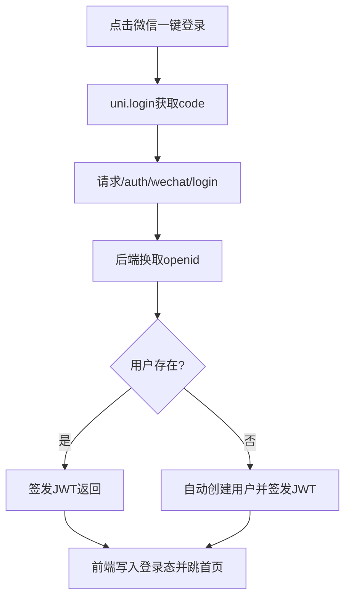

# 微信登录技术实现方案（轻量版，最少出错）

## 1. 结论（按你当前阶段）

- 你现在是**未正式上线阶段**，可以不做“历史账号绑定”。
- 推荐采用**最小可用方案**：只保留一个微信登录接口，登录即自动建号并发 JWT。
- 账号密码/验证码登录先保留，但降级为“备用入口”，不参与主流程。

---

## 2. 方案目标与边界

### 2.1 目标
- 用户一键微信登录，流程最短。
- 后端改动最少，复用现有 JWT 鉴权。
- 前端视觉上突出微信登录，弱化原注册登录入口。

### 2.2 本期边界（MVP）
- 做：`/api/auth/wechat/login` 一个接口 + 微信登录按钮接通。
- 不做：绑定已有账号、解绑、账号合并、复杂风控。

---

## 3. 现有代码基础（可直接复用）

- 前端登录页已有微信登录入口（当前是占位）。
- 后端已有 `signin/signup/logout` 与 JWT 发放机制。
- 小程序 `appid` 已配置。
- 结论：只需补一条微信登录链路即可跑通。

---

## 4. 轻量技术方案（推荐）

## 4.1 前端流程

1) 用户点击“微信一键登录”  
2) 调用 `uni.login({ provider: 'weixin' })` 获取 `code`  
3) 请求 `POST /api/auth/wechat/login`  
4) 后端返回 JWT 与用户信息  
5) 复用现有 `setToken/setUserInfo` 完成登录态写入并跳首页

## 4.2 后端流程

1) 接收 `code`  
2) 调微信 `jscode2session`，获取 `openid`  
3) 用 `openid` 查询本系统用户  
4) 若存在：直接登录并签发 JWT  
5) 若不存在：自动创建新用户（默认 ROLE_USER），再签发 JWT

---

## 5. 后端实现设计（路由->控制器->服务->仓储->Model）

## 5.1 路由

### POST `/api/auth/wechat/login`

请求：
```json
{
  "code": "wx_login_code"
}
```

响应（沿用你现有 `JwtResponse`）：
```json
{
  "accessToken": "xxx",
  "tokenType": "Bearer",
  "id": 1,
  "username": "wx_u_9f2a31",
  "email": null,
  "roles": ["ROLE_USER"]
}
```

## 5.2 控制器

- 在 `AuthController` 新增一个微信登录方法即可，不强制新建 controller。
- 只做参数校验，业务逻辑放 service。

## 5.3 服务层

- 新增 `WechatAuthService`：
  - `loginByCode(String code)`
  - 内部包含：换取 openid、查用户、自动建号、签发 JWT

## 5.4 数据模型（最轻量）

直接在 `users` 表增加 1 列：
- `wechat_openid varchar(64) unique null`

说明：
- 不单独建绑定表，减少一张表和一次关联查询。
- 你当前未上线，这个方案最简单，出错点最少。

## 5.5 配置

`application.yml` 新增：
- `wechat.miniapp.appid`
- `wechat.miniapp.secret`

---

## 6. 前端改版（弱化注册登录）

## 6.1 页面结构（推荐）

1) 主按钮：`微信一键登录`（最大、绿色、首屏可见）  
2) 协议提示：登录即同意协议  
3) 次级入口：`其他登录方式`（文字按钮，默认收起）  
4) 展开后才显示：密码登录、验证码登录、立即注册

## 6.2 视觉规则

- 微信按钮高度、字号、对比度最高。
- 账号登录区域放在折叠面板中，降低视觉权重。
- “立即注册”改为灰色文字链，不做高亮按钮。

---

## 7. 并存策略（简单且安全）

- 不删除原 `/signin` `/signup`。
- 默认不引导用户走账号注册登录。
- 账号登录仅用于测试、客服排查和个别用户兜底。

---

## 8. 关键流程图（MVP）



---

## 9. 验收标准（轻量版）

- 微信登录成功率（剔除用户主动取消）≥ 95%。
- 首次登录总耗时 ≤ 8 秒（普通网络）。
- 不出现“登录成功但仍被判未登录”的问题。
- 账号登录链路不受影响（可正常作为备用）。

---

## 10. 风险与规避（最小集）

- 微信接口失败：给出明确提示“微信登录失败，请重试”。
- openid 重复：数据库唯一索引兜底。
- 登录态误判：统一使用 `access_token` 与 `user_info`。
- 日志泄漏：不打印 `code`、`session_key`、`secret`。

---

## 11. 最小实施清单（按顺序）

1) 后端增加 `/auth/wechat/login` 接口。  
2) `users` 表增加 `wechat_openid` 唯一字段。  
3) 前端实现 `wechatLogin()`，调用新接口。  
4) 登录页改成“微信主按钮 + 其他登录折叠”。  
5) 回归 3 条链路：微信新用户、微信老用户、账号备用登录。  

---

## 12. 防错分步执行计划（每次只做一小步）

### Step 1：只改数据库字段
- 目标：给 `users` 增加 `wechat_openid` 唯一字段。
- 只做：DDL 变更，不动 Java 与前端代码。
- 验收：应用启动正常，原登录不受影响。

### Step 2：只打通后端接口骨架
- 目标：新增 `/api/auth/wechat/login` 路由，先返回固定成功结构（mock）。
- 只做：Controller + Request/Response，不接微信接口。
- 验收：接口可被调用，返回结构与 `JwtResponse` 对齐。

### Step 3：只接微信 code 换 openid
- 目标：在 service 中接入 `jscode2session`。
- 只做：外部调用与错误映射，不做自动建号。
- 验收：能拿到 openid；失败时有清晰错误提示。

### Step 4：只做自动建号与发 JWT
- 目标：按 openid 查用户，不存在则创建，最后签发 JWT。
- 只做：service + repository 逻辑，不改页面样式。
- 验收：同一微信号二次登录命中同一用户。

### Step 5：只接前端微信登录动作
- 目标：`login.vue` 的 `wechatLogin()` 调通后端接口并写入登录态。
- 只做：接口调用 + token/userInfo 存储 + 登录跳转。
- 验收：微信登录后可进入首页，受保护页面可访问。

### Step 6：只改登录页视觉层级
- 目标：微信按钮主视觉，账号登录折叠为“其他登录方式”。
- 只做：UI 布局和样式，不改接口逻辑。
- 验收：首屏视觉焦点明确落在微信登录按钮。

### Step 7：只做回归测试
- 覆盖：微信新用户、微信老用户、账号备用登录。
- 验收：3 条链路全部通过后再进入下一项需求。

### 执行纪律
- 一次只改 1 步，做完就自测并记录结果。
- 当前步骤未通过，不进入下一步。
- 每步改动尽量控制在 1-3 个文件，方便回滚。
