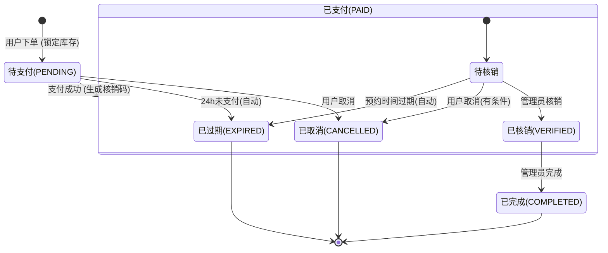

# 体育馆预约系统 - 球场管理员端产品需求文档 (PRD)

## 1. 产品核心与目标
- **定位**：为球场运营人员提供的高效管理工具，实现“一部手机/电脑管全场”。
- **核心价值**：**提效率**（快速核销、自动开关场）、**防漏单**（实时看板）、**促周转**（灵活调整时段状态）。
- **用户对象**：
  - **场馆经理（Admin）**：负责场馆创建、排期、价格调整、退款处理、订单核销。

---

## 2. 功能清单 (Feature List)

基于“最小可行性产品（MVP）”原则，仅保留 **P0** 级核心闭环功能。

| 模块 | 二级功能 | 三级功能点 | 优先级 | 描述与价值 |
| :--- | :--- | :--- | :--- | :--- |
| **工作台** | **数据看板** | **今日数据概览** | **P0** | 展示今日订单总数、待核销数、已核销数。 |
| | | **场地状态概览** | **P0** | 简单展示当前时刻有多少场地空闲、多少在使用中。 |
| | **快捷核销** | **核销码验证** | **P0** | 输入核销码（数字）查询订单信息。 |
| | | **确认核销** | **P0** | 确认订单信息无误后，执行核销操作，更新订单状态。 |
| **订单管理** | **订单列表** | **列表展示** | **P0** | 展示订单卡片（包含场馆名、预约时间、金额、状态、用户手机尾号）。 |
| | | **筛选与搜索** | **P0** | 支持按状态（待核销/已完成/退款/已取消）筛选；支持按手机号或核销码搜索。 |
| | | **类型区分** | **P0** | 列表通过标签区分“普通预约”与“拼场预约”。 |
| | **订单详情** | **基础信息展示** | **P0** | 展示订单号、下单时间、支付金额、预约人信息、联系电话。 |
| | | **拼场信息展示** | **P0** | 若为拼场订单，展示当前拼场进度、所有参与人列表。 |
| | | **订单操作** | **P0** | 支持**主动退款/取消**（仅限未核销订单，应对突发纠纷或场地不可用情况）。 |
| **场地管理** | **场馆列表** | **列表查看** | **P0** | 查看所有已创建的场馆，展示状态（营业中/休息中）。 |
| | | **上下架管理** | **P0** | 快速开启或关闭场馆的预约入口。 |
| | **场馆配置** | **基础信息编辑** | **P0** | 创建/编辑场馆名称、封面图、地址、联系电话、设施标签。 |
| | | **规则设置** | **P0** | 设置营业时间（开始/结束）、默认小时单价。 |
| | **排期管理** | **日历视图** | **P0** | 按日期查看该场馆的所有时间段状态矩阵（颜色区分状态）。 |
| | | **状态干预(锁场)** | **P0** | 选中“空闲”时间段，将其设为“维护中”（用户端不可见/不可订）。 |
| | | **状态干预(解锁)** | **P0** | 选中“维护中”时间段，将其恢复为“空闲”。 |

---

## 3. 状态流转图 (State Transitions)

### 3.1 预约订单状态流转 (Booking Order)
描述普通预约订单的生命周期。



### 3.2 拼场订单状态流转 (Sharing Order)
描述拼场订单的生命周期，包含发起、匹配、成团到核销的全过程。

```mermaid
stateDiagram-v2
    [*] --> 待支付(PENDING): 发起者创建拼场
    待支付(PENDING) --> 开放中(OPEN): 发起者支付
    待支付(PENDING) --> 已取消(CANCELLED): 发起者取消
    待支付(PENDING) --> 已过期(EXPIRED): 24h未支付(自动)
    
    state 开放中(OPEN) {
        [*] --> 招募中
        招募中 --> 等待对方支付(APPROVED_PENDING_PAYMENT): 批准申请
        招募中 --> 拼场成功(SHARING_SUCCESS): 申请者直接支付
        招募中 --> 已取消(CANCELLED): 发起者取消 / 开场2h前未拼满(自动)
        招募中 --> 已过期(EXPIRED): 超时(自动)
    }

    state 等待对方支付(APPROVED_PENDING_PAYMENT) {
        [*] --> 等待支付
        等待支付 --> 拼场成功(SHARING_SUCCESS): 申请者支付
        等待支付 --> 开放中(OPEN): 申请者支付超时(回退)
        等待支付 --> 已取消(CANCELLED): 取消
        等待支付 --> 已过期(EXPIRED): 超时(自动)
    }
    
    state 拼场成功(SHARING_SUCCESS) {
        [*] --> 待核销
        待核销 --> 已核销(VERIFIED): 管理员核销
        待核销 --> 已取消(CANCELLED): 取消(有条件)
        待核销 --> 已过期(EXPIRED): 预约过期(自动)
    }
    
    已核销(VERIFIED) --> 已完成(COMPLETED): 管理员完成
    
    已完成(COMPLETED) --> [*]
    已取消(CANCELLED) --> [*]
    已过期(EXPIRED) --> [*]
```

---

## 4. 数据流转简述 (Data Flow)

### 场景一：用户预约与核销闭环 (普通订单)
1.  **写入 (User)**：用户在小程序选座下单 -> 后端锁定 `TimeSlot` 状态为 `Locked` -> 生成 `Order` (Pending)。
2.  **更新 (System)**：用户支付 -> 后端更新 `Order` 为 `Paid`，更新 `TimeSlot` 为 `Booked` -> 生成唯一核销码 (`VerifyCode`)。
3.  **读取 (Admin)**：管理员打开“工作台” -> 轮询/推送获取今日 `Paid` 状态订单 -> 数字看板 +1。
4.  **交互 (Admin/User)**：用户报出核销码 -> 管理员端输入 -> 后端校验 `VerifyCode`。
5.  **终态 (System)**：校验通过 -> 更新 `Order` 为 `Verified` -> 释放 `TimeSlot` 关联资源（或标记为已履约）-> 写入资金结算表。

### 场景二：场地临时维护（突发流转）
1.  **决策 (Admin)**：发现 3 号场篮板损坏。
2.  **写入 (Admin)**：管理员端进入“场地管理” -> 选中 3 号场今日 14:00-18:00 时段 -> 点击“设为维护”。
3.  **校验 (Backend)**：后端检查该时段是否已有 `Paid`/`Sharing_Success`/`Sharing` 订单。
    *   **若无订单**：直接更新 `TimeSlot` 为 `Maintenance` -> 用户端不可见/不可选。
    *   **若有订单**：报错提示“存在冲突订单” -> 管理员需先进入“订单管理”联系用户并退款 -> 订单变更为 `Cancelled` -> 时段自动回滚为 `Available` -> 管理员再次设为 `Maintenance`。

### 场景三：拼场订单流转 (Sharing Flow)
1.  **发起 (User A)**：用户 A 发起拼场 -> `Order` 状态为 `Pending` -> 支付后变为 `Open` (开放中) -> `TimeSlot` 状态更新为 `Sharing`。
2.  **参与 (User B)**：用户 B 申请加入 -> `SharingRequest` 状态为 `Pending`。
3.  **批准 (User A)**：用户 A 同意申请 -> `SharingRequest` 变为 `Approved_Pending_Payment`，`Order` 变为 `Approved_Pending_Payment` (等待对方支付)。
4.  **支付 (User B)**：用户 B 支付 -> `SharingRequest` 变为 `Paid`，`Order` 变为 `Sharing_Success` (拼场成功) -> 生成统一核销码。
5.  **核销 (Admin)**：管理员输入核销码 -> 验证通过 -> 订单标记为 `Verified`。
