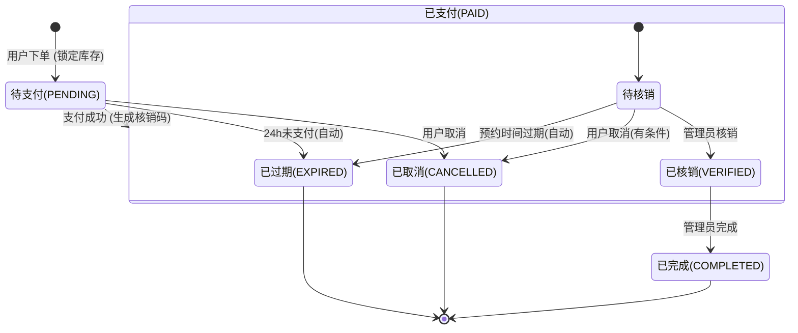

# 体育馆预约系统 - 球场管理员端产品需求文档 (PRD)

## 1. 产品核心与目标
- **定位**：为球场运营人员提供的高效管理工具，实现“一部手机管全场”。
- **核心价值**：**提效率**（快速核销、自动开关场）、**防漏单**（实时看板）、**促周转**（灵活调整时段状态）。
- **用户对象**：
  - **场馆经理（Admin）**：负责场馆创建、排期、价格调整、退款处理、订单核销。
- **范围声明**：管理员端仅提供运营与管理能力（场馆配置、排期维护、订单核销与取消/退款等），**不支持用户侧操作**（如自行下单、发起/加入拼场、自助取消等），这些行为仍由用户端小程序承担。
- **管理员账号策略**：
  - 管理员账号由运营方**手动在数据库创建**（非用户端自助注册）。
  - 管理员通过**账号+密码**登录管理员端。
  - 登录后后端按用户角色鉴权：仅 `ROLE_VENUE_ADMIN` 分配管理员权限并放行管理员端功能。
  - 非 `ROLE_VENUE_ADMIN` 账号禁止进入管理员端。

---

## 2. 功能清单 (Feature List)

基于“最小可行性产品（MVP）”原则，仅保留 **P0** 级核心闭环功能。

### 2.1 页面信息架构 (Page Information Architecture)

- **工作台（Dashboard）**
  - **入口**：管理员登录成功后的默认首页。
  - **核心区块**：
    - 数据概览卡片：支持切换时间范围（今日/本周/本月/自定义），展示订单总数、待核销数、已核销数、收益等核心指标。
    - 快捷核销区域（核销中心）：核销码输入框 + 查询按钮，查询结果以弹层/侧滑详情形式展示订单关键信息，并提供核销/完成订单入口。
    - 功能入口宫格：快速跳转至订单管理、场馆管理、排期管理、账号与安全等页面。

- **订单管理页（Orders）**
  - **子视图**：
    - 订单列表视图：支持状态/类型/场馆/日期/关键词筛选，展示订单卡片列表。
    - 订单详情视图：从列表点击进入，可为单独页面或抽屉侧滑，展示完整订单与拼场信息，并提供管理员操作（取消/退款、核销、完成订单）。

- **场地管理页（Venues）**
  - **子视图**：
    - 场馆列表视图：展示当前管理员可管理的场馆列表及其状态，支持新增/编辑/上下架/进入排期管理。
    - 场馆配置编辑视图：编辑场馆基础信息、营业规则、拼场开关、自动生成天数等配置。
    - 排期管理视图（日历）：按日期查看某场馆的时间段矩阵，支持对单个时间段执行锁场/解锁操作。

- **账号与安全页（Account & Security）**
  - **子视图**：
    - 账号信息视图（可选）：展示当前管理员基础信息（昵称、账号等）。
    - 修改密码视图：表单输入旧密码、新密码、确认新密码，提交后触发密码修改与登录态处理。

---

| 模块 | 二级功能 | 三级功能点 | 优先级 | 描述与价值 |
| :--- | :--- | :--- | :--- | :--- |
| **工作台** | **数据看板** | **数据概览** | **P0** | 可选择时间范围（今日/本周/本月/自定义）查看订单总数、待核销数、已核销数、收益（状态为已完成订单的金额）。 |
|  | **快捷核销 / 核销中心** | **核销码验证** | **P0** | 输入核销码（数字/字符串）查询订单信息。**支持输入发起者核销码(ORD)或参与者核销码(REQ)，系统自动匹配主订单。支持连续核销，保留最近核销记录（前端本地缓存）。** |
|  |  | **确认核销 / 完成订单入口** | **P0** | 确认订单信息无误后，执行核销操作，更新订单状态为已核销。**拼场订单任一成员核销即视为该场次开始使用，主订单状态变更为已核销(VERIFIED)，成员级核销状态分别记录。核销完成后，可从此处跳转订单详情页执行“完成订单”。** |
| **账号与安全** | **登录鉴权** | **管理员账号密码登录** | **P0** | 管理员使用账号密码登录，获取管理员端访问凭证。 |
| | | **角色校验分权** | **P0** | 登录后校验角色为 `ROLE_VENUE_ADMIN` 才授予管理员权限。 |
| | **安全设置** | **修改密码** | **P0** | 管理员可在已登录状态下修改登录密码。 |
| **订单管理** | **订单列表** | **列表展示** | **P0** | 展示订单卡片（包含场馆名、预约时间、金额、状态、用户手机尾号）。**状态需区分普通取消与已退款：后端以 CANCELLED + refundType=LOGIC_REFUND 表示退款，前端文案统一展示为“已退款”。** |
| | | **筛选与搜索** | **P0** | 支持按状态（全部/待核销/已核销/已完成/已退款/已取消/已过期）筛选；支持按手机号或核销码/订单号搜索。 |
| | | **类型区分** | **P0** | 列表通过标签区分“普通预约”与“拼场预约”。 |
| | **订单详情** | **基础信息展示** | **P0** | 展示订单号(即核销码)、下单时间、支付金额、预约人(用户名)、预约场地、预约日期、预约时段、预约类型、订单状态。 |
| | | **拼场信息展示** | **P0** | 若为拼场订单，展示队伍名称、联系电话、拼场说明、当前进度(人数)、人均费用。**新增：展示所有拼场成员列表（含发起者与参与者），显示昵称、手机号及各自核销状态。** |
| | | **订单操作 - 取消/退款** | **P0** | 支持**主动退款/取消**（仅限未核销订单，应对突发纠纷或场地不可用情况）。**若为拼场订单，取消主订单将自动取消关联的所有参与者申请并触发批量退款，对所有已支付成员执行逻辑退款。** |
| | | **订单操作 - 完成订单** | **P0** | 当订单已核销(VERIFIED) 后，管理员可点击“完成订单”，将状态更新为已完成(COMPLETED)，用于结算与统计收益。**完成操作仅对已核销订单开放，不可对未核销或已完成/已取消/已过期订单执行。** |
| **场地管理** | **场馆列表** | **列表查看** | **P0** | 查看所有已创建的场馆，展示状态（营业中/休息中）。 |
| | | **上下架管理** | **P0** | 快速开启或关闭场馆的预约入口。 |
| | **场馆配置** | **基础信息编辑** | **P0** | 创建/编辑场馆名称、场馆类型 (篮球、羽毛球、网球等)、封面图、地址、联系电话、设施标签、场馆介绍。 |
| | | **规则设置** | **P0** | 设置营业时间（开始/结束）、默认小时单价。 |
| | | **拼场支持开关** | **P0** | 设置该场馆是否支持拼场预约；关闭后用户端不展示拼场入口。 |
| | | **时间段自动生成策略** | **P0** | 可设置自动维持未来数天可预约时间段，系统每日滚动补齐。 |
| | **排期管理** | **日历视图** | **P0** | 按日期查看该场馆的所有时间段状态矩阵（颜色区分状态）。 |
| | | **状态干预(锁场)** | **P0** | 选中“可预约”时间段，将其设为“维护中”（用户端不可订）。 |
| | | **状态干预(解锁)** | **P0** | 选中“维护中”时间段，将其恢复为“可预约”。 |

---

## 3. 状态流转图 (State Transitions)

### 3.1 预约订单状态流转 (Booking Order)
描述普通预约订单的生命周期。



### 3.2 拼场订单状态流转 (Sharing Order)
描述拼场订单的生命周期，包含发起、匹配、成团到核销的全过程。

```mermaid
stateDiagram-v2
    [*] --> 待支付(PENDING): 发起者创建拼场
    待支付(PENDING) --> 开放中(OPEN): 发起者支付
    待支付(PENDING) --> 已取消(CANCELLED): 发起者取消
    待支付(PENDING) --> 已过期(EXPIRED): 24h未支付(自动)
    
    state 开放中(OPEN) {
        [*] --> 招募中
        招募中 --> 等待对方支付(APPROVED_PENDING_PAYMENT): 批准申请
        招募中 --> 拼场成功(SHARING_SUCCESS): 申请者直接支付
        招募中 --> 已取消(CANCELLED): 发起者取消 / 开场2h前未拼满(自动)
        招募中 --> 已过期(EXPIRED): 超时(自动)
    }

    state 等待对方支付(APPROVED_PENDING_PAYMENT) {
        [*] --> 等待支付
        等待支付 --> 拼场成功(SHARING_SUCCESS): 申请者支付
        等待支付 --> 开放中(OPEN): 申请者支付超时(回退)
        等待支付 --> 已取消(CANCELLED): 取消
        等待支付 --> 已过期(EXPIRED): 超时(自动)
    }
    
    state 拼场成功(SHARING_SUCCESS) {
        [*] --> 待核销
        待核销 --> 已核销(VERIFIED): 管理员核销
        待核销 --> 已取消(CANCELLED): 取消(有条件)
        待核销 --> 已过期(EXPIRED): 预约过期(自动)
    }
    
    已核销(VERIFIED) --> 已完成(COMPLETED): 管理员完成
    
    已完成(COMPLETED) --> [*]
    已取消(CANCELLED) --> [*]
    已过期(EXPIRED) --> [*]
```

---

## 4. 数据流转简述 (Data Flow)

### 场景一：用户预约与核销闭环 (普通订单)
1.  **写入 (User)**：用户在小程序选座下单 -> 后端锁定 `TimeSlot` 状态为 `Locked` -> 生成 `Order` (Pending)。
2.  **更新 (System)**：用户支付 -> 后端更新 `Order` 为 `Paid`，更新 `TimeSlot` 为 `Booked` -> 生成唯一核销码 (`VerifyCode`)。
3.  **读取 (Admin)**：管理员打开“工作台” -> 轮询/推送获取今日 `Paid` 状态订单 -> 数字看板 +1。
4.  **交互 (Admin/User)**：用户报出核销码 -> 管理员端输入 -> 后端校验 `VerifyCode`。
5.  **终态 (System)**：校验通过 -> 更新 `Order` 为 `Verified` -> 释放 `TimeSlot` 关联资源（或标记为已履约）-> 写入资金结算表。

### 场景二：场地临时维护（突发流转）
1.  **决策 (Admin)**：发现 3 号场篮板损坏。
2.  **写入 (Admin)**：管理员端进入“场地管理” -> 选中 3 号场今日 14:00-18:00 时段 -> 点击“设为维护”。
3.  **校验 (Backend)**：后端检查该时段是否已有 `Paid`/`Sharing_Success`/`Sharing` 订单。
    *   **若无订单**：直接更新 `TimeSlot` 为 `Maintenance` -> 用户端不可见/不可选。
    *   **若有订单**：报错提示“存在冲突订单” -> 管理员需先进入“订单管理”联系用户并退款 -> 订单变更为 `Cancelled` -> 时段自动回滚为 `Available` -> 管理员再次设为 `Maintenance`。

### 场景三：拼场订单流转 (Sharing Flow)
1.  **发起 (User A)**：场馆开启“支持拼场”后，用户 A 才可发起拼场 -> `Order` 状态为 `Pending` -> 支付后变为 `Open` (开放中) -> `TimeSlot` 状态更新为 `Sharing`。
2.  **参与 (User B)**：用户 B 申请加入 -> `SharingRequest` 状态为 `Pending`。
3.  **批准 (User A)**：用户 A 同意申请 -> `SharingRequest` 变为 `Approved_Pending_Payment`，`Order` 变为 `Approved_Pending_Payment` (等待对方支付)。
4.  **支付 (User B)**：用户 B 支付 -> `SharingRequest` 变为 `Paid`，`Order` 变为 `Sharing_Success` (拼场成功) -> 生成统一核销码。
5.  **核销 (Admin)**：管理员输入核销码 -> 验证通过 -> 订单标记为 `Verified`。

### 场景四：时间段自动生成 (Rolling Window)
1.  **配置 (Admin)**：管理员在场馆配置中选择“自动生成未来 7 天”或“自动生成未来 15 天”。
2.  **补齐 (System)**：系统按日执行补齐任务，始终保持从“今天起”向后 N 天（N=7/15）的可预约时间段完整存在。
3.  **边界 (System)**：已存在的订单时段不被覆盖；仅对缺失时间段执行新增，避免重复生成与状态冲突。

### 场景五：管理员登录与权限分配 (Admin Auth)
1.  **建号 (Admin/Ops)**：运营方在数据库手动创建管理员账号并配置角色为 `ROLE_VENUE_ADMIN`。
2.  **登录 (Admin)**：管理员输入账号密码发起登录请求。
3.  **鉴权 (Backend)**：后端校验账号密码并读取角色信息。
4.  **分权 (System)**：若角色为 `ROLE_VENUE_ADMIN`，签发管理员权限令牌并放行管理员端功能；否则拒绝访问管理员端。
5.  **安全 (Admin)**：管理员在“账号与安全”中发起修改密码，后端校验旧密码后更新新密码并使旧登录态按策略失效。
