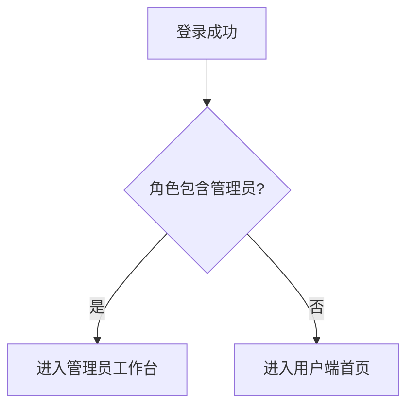
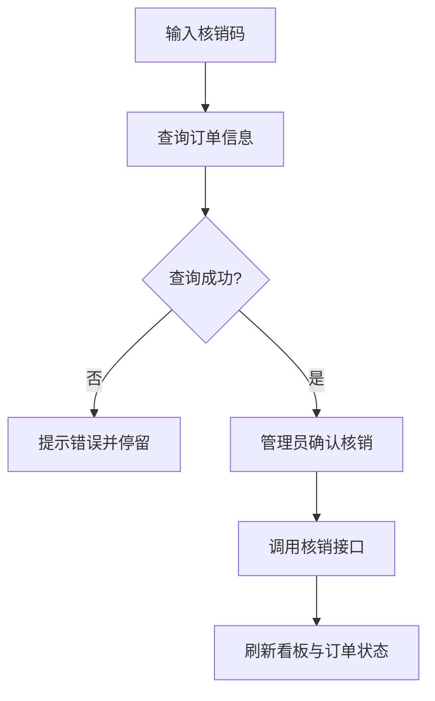
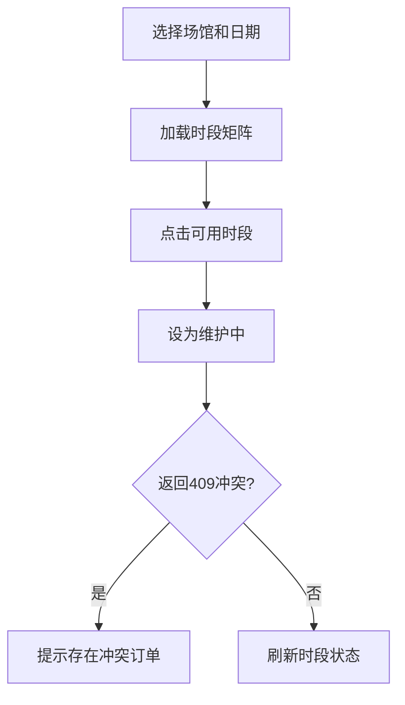

# 体育馆预约系统 - 管理员端前端开发文档（可直接交付 Agent 开发）

## 1. 文档定位与使用方式

### 1.1 文档目标

- 本文档用于指导 **uni-app(Vue3)+微信小程序** 管理员端前端开发，目标是让 Agent 按文档直接落地代码，减少返工和联调错误。
- 文档强调“**复用现有用户端能力**”：复用组件、请求层、样式体系、状态管理模式，避免重复造轮子。

### 1.2 需求与接口依据

- 后端接口真值：`api_documentation.md`
- 后端管理员实现进度与约束：`backend_admin_dev_guide.md`
- 产品需求与状态流转：`球场管理员端产品需求文档.md`

### 1.3 交付范围（P0）

- 管理员登录后能力：
  - 工作台（统计 + 快捷核销）
  - 账号与安全（修改密码）
  - 订单管理（列表筛选、详情、管理员取消）
  - 场馆管理（已创建场馆列表、上下架、新增/编辑配置）
  - 排期管理（锁场/解锁，冲突提示）
  - 核销管理（按核销码查询、核销、完成）

### 1.4 非本期范围（避免范围膨胀）

- 不做全新视觉风格，不重构用户端 UI 基础设施。
- 不做后端未实现接口（文档中明确“前端存在但后端未实现”的路径全部禁用或隐藏）。
- 不做二维码核销（核销码文本输入/扫码文本解析即可）。

***

## 2. 项目技术基线与强约束

### 2.1 技术基线（必须遵守）

- 前端：`uni-app + Vue3`
- 运行环境：HBuilderX、微信开发者工具
- 状态管理：`Pinia`（已落地，禁止新模块回退到 Vuex）
- 请求层：`src/utils/request.js`（已包含 token 注入、重试、缓存、错误处理）

### 2.2 与现有工程保持一致的关键点

- 登录态来源：
  - `src/utils/auth.js` 的 token 与 userInfo
  - `src/stores/user.js` 是唯一用户状态主入口
- API 层风格：
  - `src/api/*.js` 单文件单业务域
  - 使用 `get/post/put/patch/del` 封装函数
- 页面路由：
  - 全量由 `src/pages.json` 管理
  - 受 `src/utils/router-guard.js` 登录拦截影响

### 2.3 管理员端与用户端共存原则

- 同一小程序内共存，使用角色分流，不拆新工程。
- 统一主题色、卡片阴影、文字层级、空态组件，视觉保持用户端一致。
- 管理员能力通过“入口页 + 权限守卫 + API 权限错误兜底”实现安全闭环。

***

## 3. 角色模型与权限矩阵

### 3.1 角色判定规则

- 登录成功后读取 `userInfo.roles`：
  - 包含 `ROLE_VENUE_ADMIN`：可进入管理员端
  - 仅 `ROLE_USER`：禁止访问管理员页面，提示并回到用户端首页

### 3.2 页面级权限矩阵

| 页面模块            | ROLE\_VENUE\_ADMIN |
| --------------- | ------------------ |
| 管理员首页（工作台）      | ✅                  |
| 账号与安全（修改密码）     | ✅                  |
| 订单管理/详情/取消      | ✅                  |
| 核销管理            | ✅                  |
| 场馆管理（列表/上下架/配置） | ✅                  |
| 排期管理            | ✅                  |

### 3.3 权限控制分层

- 路由前置拦截：页面是否允许进入。
- 页面内按钮级权限：无权限则隐藏，不做“点了才报错”。
- API 失败兜底：403 提示“无权限操作该资源”并留在当前页。

***

## 4. 信息架构与路由规划

## 4.1 新增页面建议路径

| 页面         | 路由                               |
| ---------- | -------------------------------- |
| 管理员首页（工作台） | `pages/admin/dashboard`          |
| 订单列表       | `pages/admin/orders/list`        |
| 订单详情       | `pages/admin/orders/detail`      |
| 核销中心       | `pages/admin/verification/index` |
| 场馆列表（我管理）  | `pages/admin/venues/list`        |
| 新增场馆       | `pages/admin/venues/create`      |
| 场馆编辑       | `pages/admin/venues/edit`        |
| 排期管理       | `pages/admin/timeslots/index`    |
| 修改密码 / 我的   | `pages/admin/security/password`  |

### 4.2 导航结构建议

- 管理员端采用**自绘底部导航条（非小程序原生 TabBar）**，与用户端主 Tab 共存但互不干扰。
- 底部导航包含 5 个入口，布局与 `admin_prototype.html` 保持一致：
  - 左一：工作台（📊）
  - 左二：订单管理（📋）
  - 中间高亮圆形按钮：核销中心（📷），作为最显眼的快捷入口
  - 右二：场馆管理（🏟️）
  - 右一：账号与安全（👤，“我的”）
- 每个 Tab 对应一个基础页面（`tab-page`），详情类页面通过内部路由 `router.push` 以子页面形式叠加，顶部使用统一 `NavBar` 返回。

### 4.3 页面跳转主链路

1. 登录页成功后识别角色
2. 管理员跳转 `pages/admin/dashboard`
3. 通过底部导航在“工作台 / 订单 / 核销 / 场馆 / 我的”之间切换
4. 详情页操作后返回列表并局部刷新

***

## 5. API 契约（按前端实现视角）

> 说明：下表只列管理员端 P0 必需接口，均来自当前后端已实现能力；前端禁止调用“未实现路径”。

## 5.1 工作台

| 用途     | 方法   | 路径                          | 关键参数                          | 前端说明                           |
| ------ | ---- | --------------------------- | ----------------------------- | ------------------------------ |
| 统计看板   | GET  | `/admin/dashboard/stats`    | `timeRange,startDate,endDate` | 时间维度切换 today/week/month/custom |
| 按核销码查询 | GET  | `/verification/code/{code}` | 路径参数 code                     | 支持 ORD/REQ 两类码                 |
| 按核销码核销 | POST | `/verification/code/verify` | `{code}`                      | 核销成功后刷新统计                      |

## 5.2 订单管理

| 用途      | 方法   | 路径                            | 关键参数                                                          | 前端说明                        |
| ------- | ---- | ----------------------------- | ------------------------------------------------------------- | --------------------------- |
| 管理员订单列表 | GET  | `/admin/bookings`             | `page,pageSize,status,keyword,venueId,type,startDate,endDate` | 列表只展示主订单                    |
| 订单详情    | GET  | `/bookings/{id}`              | id                                                            | 拼场单需展示 participants         |
| 管理员取消   | POST | `/bookings/{id}/admin-cancel` | id                                                            | 仅 PAID/SHARING\_SUCCESS 可操作 |

## 5.3 场馆与排期

| 用途         | 方法     | 路径                                                 | 关键参数         | 前端说明                                                                    |
| ---------- | ------ | -------------------------------------------------- | ------------ | ----------------------------------------------------------------------- |
| 我管理的场馆     | GET    | `/venues/manager/me`                               | 无            | 管理员主入口列表                                                                |
| 创建场馆       | POST   | `/venues`                                          | Venue Body   | 新建场馆基础信息与管理配置                                                           |
| 场馆上下架/营业状态 | PATCH  | `/venues/{id}/status`                              | `{status}`   | 支持 OPEN/CLOSED/MAINTENANCE                                              |
| 更新场馆       | PUT    | `/venues/{id}`                                     | Venue Body   | 包含 coverImage、contactPhone、facilityTags、supportSharing、autoGenerateDays |
| 删除场馆       | DELETE | `/venues/{id}`                                     | id           | 删除当前管理员管理范围内场馆                                                          |
| 场馆时段查询     | GET    | `/timeslots/venue/{venueId}/date/{date}`           | venueId,date | 排期矩阵数据源                                                                 |
| 更新时段状态     | PATCH  | `/timeslots/{id}/status`                           | `{status}`   | MAINTENANCE/AVAILABLE                                                   |
| 可用时段查询     | GET    | `/timeslots/venue/{venueId}/date/{date}/available` | venueId,date | 可选辅助                                                                    |

- 管理员端不再使用：`/venues/{id}/manager`、`/venues/manager/{managerId}`、`/venues/update-sharing-support`。

## 5.4 核销与订单完成

| 用途          | 方法   | 路径                                   | 关键参数 | 前端说明          |
| ----------- | ---- | ------------------------------------ | ---- | ------------- |
| 按订单ID核销（兼容） | POST | `/verification/orders/{id}/verify`   | id   | 从订单详情触发       |
| 完成订单        | POST | `/verification/orders/{id}/complete` | id   | VERIFIED 后可操作 |
| 核销状态        | GET  | `/verification/orders/{id}/status`   | id   | 详情页状态刷新       |

## 5.5 账号与安全

| 用途   | 方法  | 路径                   | 关键参数                        | 前端说明         |
| ---- | --- | -------------------- | --------------------------- | ------------ |
| 修改密码 | PUT | `/users/me/password` | `{oldPassword,newPassword}` | 登录后管理员自助修改密码 |

### 5.6 需要新增的前端 API 封装函数（当前缺口）

- `src/api/admin.js` 新增/补齐：
  - `getAdminDashboardStats`
  - `getAdminBookings`
  - `adminCancelBooking`
  - `getMyManagedVenues`
  - `createVenue`
  - `updateVenue`
  - `deleteVenue`
  - `updateVenueStatus`
- `src/api/verification.js` 新增：
  - `getOrderByVerifyCode`
  - `verifyByCode`
- 可选新增 `src/api/admin-timeslot.js`（或并入 `admin.js`）：
  - `getVenueTimeslotsByDate`
  - `updateTimeslotStatus`

***

## 6. 数据模型与枚举（前端统一）

### 6.1 订单状态映射（管理端）

- 待核销集合：`PAID`, `SHARING_SUCCESS`
- 已核销集合：`VERIFIED`, `COMPLETED`
- 退款展示：当前后端以 `CANCELLED + refundType=LOGIC_REFUND` 表达（前端文案可显示“已退款”）
- 不可管理员取消：`VERIFIED`, `COMPLETED`, `CANCELLED`, `EXPIRED`

### 6.2 时段状态（与用户端一致）

- `AVAILABLE`：可用（可预约/可解锁目标）
- `MAINTENANCE`：维护中（不可预约）
- `BOOKED/OCCUPIED/RESERVED`：已占用（不可锁场，需提示冲突）

### 6.3 订单类型

- `EXCLUSIVE`：普通预约
- `SHARED`：拼场预约（详情需显示 participants）

### 6.4 核销码格式

- `ORD...`：主订单码
- `REQ_xxx`：参与者码（后端反查主单）

***

## 7. 组件复用策略（重点降本）

### 7.1 可直接复用组件清单

| 现有组件                 | 管理员端用途        | 处理方式                   |
| -------------------- | ------------- | ---------------------- |
| `NavBar.vue`         | 所有页面顶部栏       | 直接复用                   |
| `SearchBar.vue`      | 订单 keyword 搜索 | 直接复用                   |
| `LoadMore.vue`       | 列表分页加载        | 直接复用                   |
| `SkeletonScreen.vue` | 首屏骨架          | 直接复用                   |
| `BookingCard.vue`    | 订单列表卡片        | 轻改 props（显示手机号尾号/类型标签） |
| `VenueCard.vue`      | 场馆列表          | 轻改（增加管理动作区）            |
| `TimeSlot.vue`       | 排期矩阵基础单元      | 建议抽管理版包装组件             |

### 7.2 新增组件（最少化）

- `AdminStatCard.vue`：工作台统计卡片
- `AdminActionGrid.vue`：首页功能入口宫格
- `VerifyCodeInput.vue`：核销码输入+校验按钮
- `OrderFilterBar.vue`：订单状态/类型/日期筛选条
- `TimeslotStatusLegend.vue`：时段状态图例

### 7.3 样式复用规范

- 颜色、圆角、阴影沿用用户端变量，不新建第二套设计 token。
- 新组件尽量复用 `.card`, `.section-title`, `.status-tag-*` 等已存在样式语义。
- 保持“用户端同等级页面同布局密度”：标题字号、卡片留白、按钮高度一致。

***

## 8. 状态管理设计（Pinia）

### 8.1 Store 划分

- `stores/admin-dashboard.js`
  - stats、timeRange、loading
- `stores/admin-orders.js`
  - list、filters、pagination、selectedOrder、participants
- `stores/admin-venues.js`
  - managerVenues、editingVenue、timeslotsByDate
- `stores/admin-verification.js`
  - currentCode、verifyResult、verifying
- `stores/admin-security.js`
  - passwordForm、submitting

### 8.2 状态更新原则

- 列表页操作成功后优先“局部更新 + 局部刷新”，避免全页重载。
- 详情页返回列表时按 `id` 精准刷新对应项状态。
- 统计看板数据在核销/取消后执行轻量 `refreshStats()`。

### 8.3 与现有 user store 的关系

- 角色判断统一从 `useUserStore().userInfo.roles` 读取。
- 管理员路由守卫不重复维护 token 逻辑，只做角色校验补充。

***

## 9. 页面级详细开发说明

## 9.1 管理员工作台 `pages/admin/dashboard`

### 页面目标

- 汇总运营核心数据，提供最快入口。

### 核心区块

1. 时间范围切换（today/week/month/custom），采用顶部“今日 / 本周 / 本月 / 自定义”标签切换，当前选中高亮。
2. 统计卡片：两列栅格展示关键指标（预计收益、总订单数、待核销、已核销、退款/取消、客单价等），视觉风格参考原型中的彩色渐变卡片 + 白底卡片组合。
3. 快捷入口：通过底部高亮“核销”Tab 以及工作台内提示文案，引导管理员一跳进入核销中心完成快捷核销；工作台自身不承载核销输入框，以保证页面聚焦于数据概览。
4. 其余功能入口：后续可按需要在工作台中加入功能宫格入口，但当前 MVP 可保持精简，仅展示统计”。

### 交互要求

- custom 需展示开始/结束日期选择；缺少任一日期禁止查询。
- 核销成功后弹成功提示并刷新统计。
- 核销失败显示后端 message（如“核销码不存在”）。

## 9.2 订单列表 `pages/admin/orders/list`

### 筛选项

- 状态：全部/待核销/已核销/已完成/已退款/已取消/已过期
- 类型：全部/普通/拼场
- 场馆：下拉选择（来源我管理场馆）
- 日期：startDate \~ endDate
- 关键词：手机号片段 / ORD / REQ

布局参考 `admin_prototype.html`：

- 顶部固定搜索输入框用于手机号/核销码模糊搜索，输入即触发列表刷新。
- 搜索框下方为横向可滚动的状态筛选 Chip（filter-bar），当前选中项高亮，支持单选状态快速切换。

### 列表字段

- 场馆名、预约时间、订单类型、状态、金额、手机号尾号、订单号
- 操作按钮：
  - 查看详情（全部）
  - 管理员取消（仅 PAID/SHARING\_SUCCESS）

### 关键规则

- 若 keyword 为 `REQ_`，列表也只展示主订单（由后端保证，前端仅展示）。
- 取消成功后更新当前卡片状态为 `CANCELLED` 并刷新统计；若后端返回 `CANCELLED + refundType=LOGIC_REFUND`，状态文案统一展示为“已退款”。

## 9.3 订单详情 `pages/admin/orders/detail`

### 基础信息

- 订单号、状态、下单时间、预约人、手机号、场馆、日期、时段、金额、类型

### 拼场增强信息（SHARED）

- 队伍名称、拼场说明、人数进度、人均费用
- participants 列表：
  - 昵称
  - 手机号脱敏
  - 核销状态
  - 核销码（如后端返回）

### 操作区

- 核销（按订单ID）
- 完成订单
- 管理员取消（未核销前）

交互与布局：

- 详情主体内容在可滚动区域展示，底部使用固定悬浮操作栏（footer-actions），始终贴底显示可用操作按钮，避免长页面滚动后按钮不见。
- 根据订单状态动态控制按钮显隐与禁用态：例如已完成/已取消/已过期订单仅展示灰态状态说明，不显示“取消/完成”等操作按钮。

## 9.4 核销中心 `pages/admin/verification/index`

### 流程

1. 输入核销码（支持 ORD/REQ）
2. 调用查询接口回显订单
3. 管理员确认后执行核销
4. 可继续“完成订单”或返回

### UX 细节

- 输入框居中放大显示，使用大字号与字距（letter-spacing）增强可读性，参考原型中的“数码牌”效果；输入时自动去除前后空格。
- 点击“查询并核销”后，若核销成功，弹出成功提示并将本次记录写入“最近核销记录”列表（本地缓存最近 5 条），列表按时间倒序展示。
- 若核销码无效或后端返回错误，使用全局 toast 展示后端 message，并不写入历史列表。

## 9.5 场馆管理 `pages/admin/venues/list` + `edit`

### 列表页

- 展示已创建场馆列表（当前管理员可管理范围）：名称、状态、营业时间、价格、拼场开关、自动生成天数
- 快捷操作：通过导航栏右侧“新增”按钮进入创建页；在每个场馆卡片内提供编辑、上下架、查看排期等操作入口。

### 编辑页关键字段

- 基础信息：名称、类型、封面图（coverImage）、位置、联系电话（contactPhone）、设施标签（facilityTags）、场馆介绍、价格、营业时间
- 管理配置：`supportSharing`、`autoGenerateDays`
- 状态设置：OPEN/CLOSED/MAINTENANCE（场馆上下架入口）

## 9.6 排期管理 `pages/admin/timeslots/index`

### 功能点

- 选择场馆 + 日期，展示时段矩阵
- 对 AVAILABLE 时段可设为 MAINTENANCE
- 对 MAINTENANCE 时段可恢复 AVAILABLE

### 冲突处理

- 接口返回 409 时，优先展示后端 message：
  - “存在冲突订单，无法设为维护中，请先处理订单”

## 9.7 账号与安全 `pages/admin/security/password`

### 功能点

- 管理员修改登录密码（旧密码 + 新密码 + 确认新密码）
- 表单校验：新密码长度、两次输入一致
- 成功后提示并按策略要求重新登录

***

## 10. 路由守卫与登录分流改造

### 10.1 登录后分流逻辑（必须）

- 登录成功后：
  1. 管理员登录只走账号密码 `POST /auth/signin`（不走微信登录分流）
  2. 读取 `roles`
  3. 若包含 `ROLE_VENUE_ADMIN` → `reLaunch('/pages/admin/dashboard')`
  4. 否则走用户端首页

### 10.2 管理员页面访问限制

- 在 `router-guard` 增加管理员页面前缀校验：
  - `pagePath.startsWith('/pages/admin/')`
- 非管理员角色访问管理员页：
  - toast 提示“无管理员权限”
  - 重定向用户端首页

***

## 11. API 层与适配层实施规范

### 11.1 新增 `src/api/admin-dashboard.js`（推荐）

- 只放 dashboard 与 admin bookings 能力，避免 `admin.js` 过大。

### 11.2 响应适配函数（减少页面判断）

- 新建 `src/utils/admin-adapter.js`：
  - `adaptAdminStats(raw)`
  - `adaptAdminOrder(raw)`
  - `adaptParticipant(raw)`
- 统一把后端字段差异转换为页面稳定字段，页面层禁止直接读裸响应。

### 11.3 错误处理映射

- 400：参数错误/核销码无效 → 直接展示 message
- 401：登录失效 → 复用 request 层逻辑跳登录
- 403：无权限 → toast + 保持当前页
- 404：资源不存在 → toast + 返回上一页
- 409：锁场冲突 → 明确冲突提示，不通用“请求失败”

***

## 12. 开发任务拆解（Agent 可直接执行）

## 阶段 A：基础铺设

1. 新增管理员页面路由到 `pages.json`
2. 扩展路由守卫支持管理员角色拦截
3. 登录成功分流到管理员首页
4. 新增管理员 API 封装（缺口函数补齐）

## 阶段 B：核心业务页面

1. 工作台页面（统计 + 快捷核销）
2. 订单列表 + 筛选 + 分页
3. 订单详情 + participants 展示
4. 管理员取消逻辑接入

## 阶段 C：场馆与排期

1. 我管理场馆列表
2. 场馆新增/编辑/删除与上下架（含 coverImage、contactPhone、facilityTags、supportSharing、autoGenerateDays）
3. 排期矩阵 + 锁场/解锁
4. 409 冲突提示联调

## 阶段 D：账号与安全

1. 修改密码页面
2. 密码强度与一致性校验
3. 修改成功后的登录态处理

## 阶段 E：联调与验收

1. 全链路冒烟（登录→工作台→订单→核销→排期）
2. 关键异常码校验（401/403/409）
3. 样式一致性检查与可用性修正

***

## 13. 页面交互流程图（供实现与评审）

### 13.1 登录分流



### 13.2 快捷核销



### 13.3 排期锁场



***

## 14. 验收标准（Definition of Done）

### 14.1 功能验收

- 管理员账号可登录并进入工作台。
- 工作台统计可按时间范围正确切换。
- 核销码支持 ORD/REQ 查询并核销成功。
- 订单列表支持状态、类型、场馆、日期、keyword 组合筛选。
- 拼场订单详情可展示 participants。
- 管理员取消仅在允许状态可见且执行成功。
- 场馆支持创建/删除，且配置可更新 coverImage、contactPhone、facilityTags、supportSharing 与 autoGenerateDays。
- 排期锁场遇冲突可正确提示 409 信息。

### 14.2 权限验收

- 普通用户不能访问任一 `/pages/admin/*` 页面。
- 非 `ROLE_VENUE_ADMIN` 账号不可进入管理员端。
- 403 返回时前端不崩溃，提示明确。

### 14.3 体验验收

- 视觉风格与用户端一致，无明显割裂。
- 主要页面首屏有骨架或加载反馈。
- 空数据、错误、重试路径完整。

***

## 15. 测试清单（开发自测 + 联调）

### 15.1 自测最小闭环

1. 管理员登录
2. 查看 dashboard 统计
3. 进入订单列表按 `REQ_` 搜索
4. 查看拼场详情 participants
5. 执行管理员取消
6. 返回 dashboard 验证统计变化
7. 进入排期页执行锁场/解锁

### 15.2 异常自测

- 错误核销码：400
- 登录过期：401
- 无权限页面：403
- 锁场冲突：409

### 15.3 兼容性

- 微信开发者工具真机调试（iOS/Android 各一台）
- 长列表滚动与筛选复合场景不卡顿

***

## 16. 实施注意事项（高频踩坑预防）

- 禁止调用后端未实现接口（如 `/auth/refresh`、`/payments/records` 等）。
- 管理员端登录与分流基于 `/auth/signin` + `ROLE_VENUE_ADMIN`，不要使用微信登录路径做管理员入口。
- 管理员端页面不要硬编码角色名集合，统一使用常量配置。
- 日期参数统一 `yyyy-MM-dd`，避免时区导致筛选偏差。
- 对拼场 participants 字段做空值兼容，防止详情页渲染报错。
- 任何“取消/锁场/上下架”类高风险操作都必须二次确认。

***

## 17. 建议目录结构（最终形态）

```text
src/
  api/
    admin.js
    admin-dashboard.js
    verification.js
  stores/
    admin-dashboard.js
    admin-orders.js
    admin-venues.js
    admin-verification.js
    admin-security.js
  pages/
    admin/
      dashboard.vue
      orders/
        list.vue
        detail.vue
      verification/
        index.vue
      venues/
        list.vue
        create.vue
        edit.vue
      timeslots/
        index.vue
      security/
        password.vue
  components/
    admin/
      AdminStatCard.vue
      AdminActionGrid.vue
      VerifyCodeInput.vue
      OrderFilterBar.vue
      TimeslotStatusLegend.vue
```

***

## 18. 文档执行说明（给 Agent）

- 严格按“阶段 A→E”顺序推进，避免跨模块并发改动导致冲突。
- 每完成一个阶段就执行一次最小自测，再进入下一阶段。
- 若后端返回字段与文档不一致，优先通过 `adapter` 收敛，不直接在页面里写兼容分支。
- 所有新页面优先复用现有组件和样式类，只有在复用不足时才新增组件。

***

## 19. 本文档与现有文档关系

- 本文档是“管理员端前端执行版”，优先级高于旧的通用前端文档中管理员相关内容。
- 旧文档可继续作为用户端参考，但管理员端开发以本文件为准。

