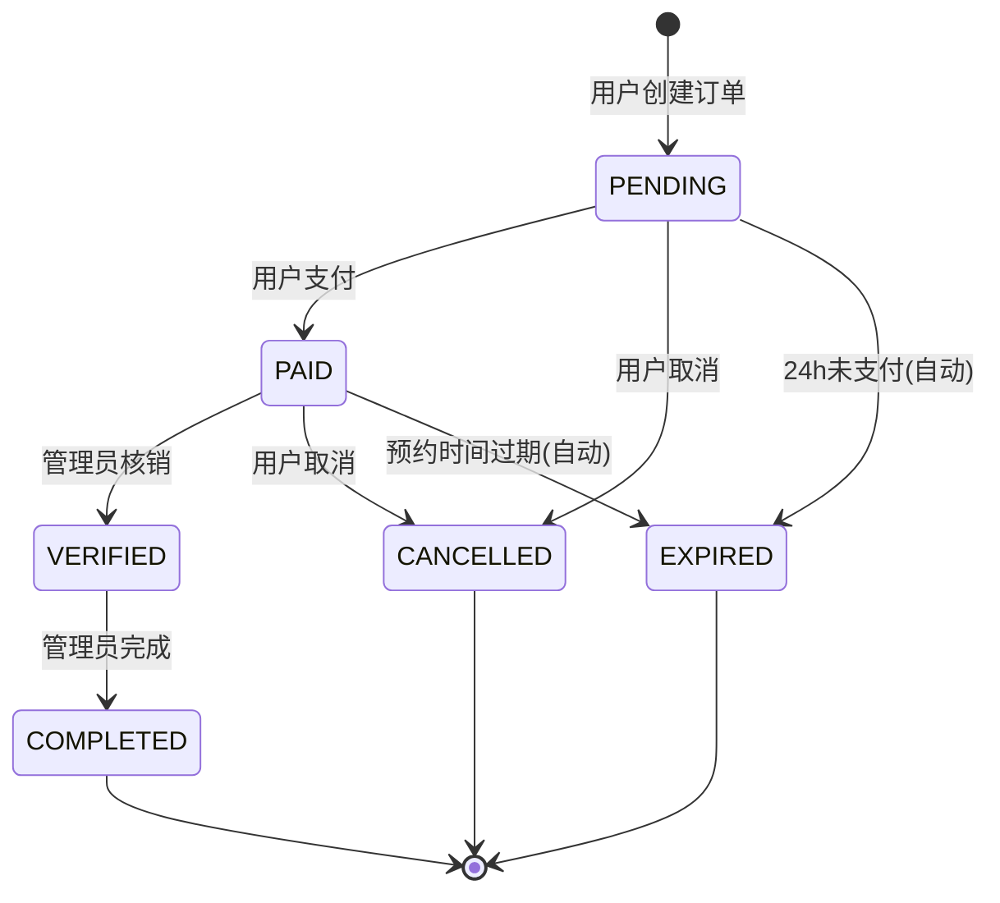
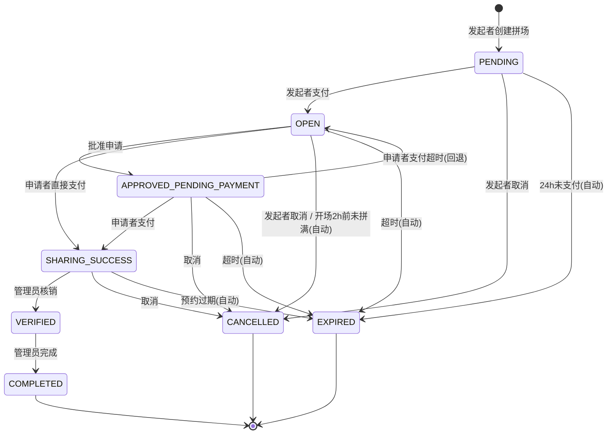
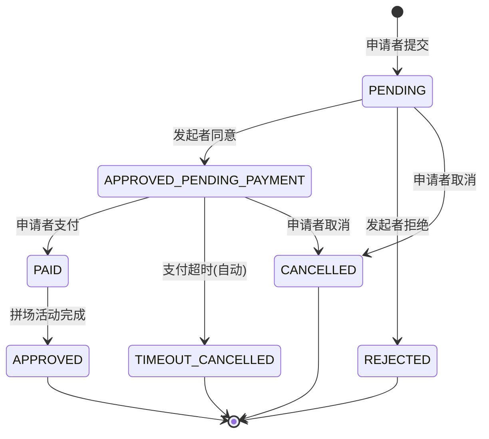

# 体育馆预约系统 - 订单状态流转全景图

> 📅 最后更新：2026-03-11
> 本文档基于代码实际实现梳理，包含三条业务线的完整状态流转

---

## 📋 系统概述

本系统涉及 **3 个核心实体**，每个实体有独立的状态体系：

| 实体 | 数据表 | 用途 | 关键角色 |
|------|--------|------|----------|
| **Order（主订单）** | `order` | 记录每一笔预约 | 用户、管理员 |
| **SharingOrder（拼场订单）** | `sharing_orders` | 管理拼场活动的整体信息 | 发起者 |
| **SharingRequest（拼场申请）** | `sharing_request` | 管理申请加入拼场的申请记录 | 申请者、发起者 |

---

## 一、主订单（Order）状态流转

### 1.1 所有状态一览

| 状态码 | 中文名 | 界面Tab显示 | 适用订单类型 | 说明 |
|--------|--------|-------------|-------------|------|
| `PENDING` | 待支付 | ✅ 待支付 | 通用 | 订单已创建，等待用户付款 |
| `PAID` | 已支付 | ✅ 已支付 | 独享订单 | 独享订单付款完成（等同于预订成功） |
| `VERIFIED` | 已核销 | ✅ 已核销 | 通用 | 用户到场使用，管理员已核销 |
| `COMPLETED` | 已完成 | ✅ 已完成 | 通用 | 订单全部流程结束 |
| `CANCELLED` | 已取消 | ✅ 已取消 | 通用 | 订单被用户或系统取消 |
| `EXPIRED` | 已过期 | ✅ 已过期 | 通用 | 超时未支付或预约时间已过 |
| `OPEN` | 开放中 | ✅ 开放中 | 拼场订单 | 发起者已支付，等待他人申请加入 |
| `APPROVED_PENDING_PAYMENT` | 等待对方支付 | ✅ 等待对方支付 | 拼场订单 | 发起者批准申请，等待申请者支付 |
| `SHARING_SUCCESS` | 拼场成功 | ✅ 拼场成功 | 拼场订单 | 双方均已支付，拼场成功 |
| `PENDING_FULL` | 待满员 | （保留未用） | 拼场订单 | 预留给多人拼场场景 |
| `FULL` | 已满员 | （保留未用） | 拼场订单 | 拼场人数已满 |

### 1.2 普通订单（独享）状态流转

```
用户创建订单
     │
     ▼
 ┌─────────┐    用户支付     ┌─────────┐   管理员核销   ┌─────────┐   管理员完成   ┌─────────┐
 │ PENDING  │──────────────▶│  PAID   │─────────────▶│VERIFIED │─────────────▶│COMPLETED│
 │ 待支付   │               │ 已支付   │              │ 已核销   │              │ 已完成   │
 └─────────┘               └─────────┘              └─────────┘              └─────────┘
     │                          │                        
     │ 用户取消                  │ 用户取消                
     ▼                          ▼                        
 ┌─────────┐              ┌─────────┐              
 │CANCELLED│              │CANCELLED│              
 │ 已取消   │              │ 已取消   │              
 └─────────┘              └─────────┘              
     ▲                          ▲
     │ 24小时未支付(自动)         │ 预约过期(自动)
 ┌─────────┐              ┌─────────┐
 │ EXPIRED │              │ EXPIRED │
 │ 已过期   │              │ 已过期   │
 └─────────┘              └─────────┘
```

**关键规则：**
- `PENDING → EXPIRED`：创建后 **24小时** 未支付，定时任务自动过期
- `PAID → EXPIRED`：预约时间已过但未核销，定时任务自动过期
- 终态（`COMPLETED`、`CANCELLED`、`EXPIRED`）不可再变更

### 1.3 拼场订单状态流转

```
用户创建拼场订单
     │
     ▼
 ┌─────────┐   发起者支付    ┌─────────┐   批准申请    ┌──────────────────────┐   申请者支付    ┌────────────────┐
 │ PENDING  │─────────────▶│  OPEN   │────────────▶│APPROVED_PENDING_     │─────────────▶│ SHARING_       │
 │ 待支付   │              │ 开放中   │             │PAYMENT               │              │ SUCCESS        │
 └─────────┘              │等待申请者│             │ 等待对方支付            │              │ 拼场成功        │
                          └─────────┘             └──────────────────────┘              └────────────────┘
                               │                         │                                     │
                               │ 开场前2h未拼满            │ 支付超时                              │ 管理员核销
                               │ (自动取消)                │ (回退到OPEN)                          │
                               ▼                         ▼                                     ▼
                          ┌─────────┐              ┌─────────┐                          ┌─────────┐
                          │CANCELLED│              │  OPEN   │                          │VERIFIED │
                          │ 已取消   │              │ 开放中   │                          │ 已核销   │
                          └─────────┘              └─────────┘                          └─────────┘
                                                                                             │
                                                                                             ▼
                                                                                        ┌─────────┐
                                                                                        │COMPLETED│
                                                                                        │ 已完成   │
                                                                                        └─────────┘
```

**关键规则：**
- `PAID → OPEN`：拼场订单支付后自动变为开放中，等待匹配
- `OPEN → APPROVED_PENDING_PAYMENT`：发起者批准某位申请者后
- `APPROVED_PENDING_PAYMENT → SHARING_SUCCESS`：申请者完成支付后
- `APPROVED_PENDING_PAYMENT → OPEN`：申请者支付超时，订单重新开放
- `OPEN → CANCELLED`：开场前 **2小时** 未拼满，定时任务自动取消

### 1.4 状态转换规则汇总表

| 当前状态 | 可转换到的目标状态 | 触发方式 | 操作权限 |
|---------|------------------|---------|---------|
| `PENDING` | `PAID`, `OPEN`, `CANCELLED`, `EXPIRED` | 手动/自动 | 用户/系统 |
| `PAID` | `VERIFIED`(独享), `OPEN`(拼场), `CANCELLED` | 手动 | 用户/管理员 |
| `OPEN` | `APPROVED_PENDING_PAYMENT`, `SHARING_SUCCESS`, `CANCELLED`, `EXPIRED` | 手动/自动 | 用户/系统 |
| `APPROVED_PENDING_PAYMENT` | `SHARING_SUCCESS`, `OPEN`, `CANCELLED`, `EXPIRED` | 手动/自动 | 用户/系统 |
| `SHARING_SUCCESS` / `FULL` | `VERIFIED`, `CANCELLED` | 手动 | 管理员/用户 |
| `VERIFIED` | `COMPLETED` | 手动 | 管理员 |
| `COMPLETED` | ❌ 终态 | - | - |
| `CANCELLED` | ❌ 终态 | - | - |
| `EXPIRED` | ❌ 终态 | - | - |

---

## 二、拼场订单（SharingOrder）状态流转

> SharingOrder 是拼场活动的"容器"，管理整个拼场活动的生命周期。

### 2.1 所有状态一览

| 状态码 | 中文名 | 说明 |
|--------|--------|------|
| `OPEN` | 开放中 | 正在招募参与者 |
| `FULL` | 已满 | 人数已满（currentParticipants ≥ maxParticipants） |
| `CONFIRMED` | 已确认 | 拼场已确认成功（拼场成功即确认） |
| `CANCELLED` | 已取消 | 拼场活动被取消 |
| `EXPIRED` | 已过期 | 拼场活动过期 |

### 2.2 状态流转图

```
 ┌─────────┐   有人加入    ┌─────────┐   拼场成功    ┌──────────┐
 │  OPEN   │────────────▶│  FULL   │────────────▶│CONFIRMED │
 │ 开放中   │              │ 已满     │              │ 已确认    │
 └─────────┘              └─────────┘              └──────────┘
     │  ▲                      │
     │  │ 有人退出               │ 
     │  └──────────────────────┘
     │
     │ 超时/取消
     ▼
 ┌─────────┐
 │CANCELLED│  或  EXPIRED
 │ 已取消   │
 └─────────┘
```

**与主订单的关联规则：**
- 主订单变为 `OPEN` → SharingOrder 状态 = `OPEN`
- 主订单变为 `SHARING_SUCCESS`/`FULL` → SharingOrder 状态 = `CONFIRMED`
- 主订单变为 `CANCELLED` → SharingOrder 状态 = `CANCELLED`

---

## 三、拼场申请（SharingRequest）状态流转

> SharingRequest 记录的是"某个用户申请加入某个拼场"的记录。

### 3.1 所有状态一览

| 状态码 | 中文名 | 前端显示 | 说明 |
|--------|--------|---------|------|
| `PENDING` | 待处理 | 待处理 | 申请提交后等待发起者审核 |
| `APPROVED_PENDING_PAYMENT` | 已批准待支付 | 已同意(待支付) | 发起者同意，等待申请者付款 |
| `PAID` | 已支付 | 拼场成功 | 申请者已完成支付 |
| `APPROVED` | 已完成 | 已完成 | 拼场整体完成 |
| `REJECTED` | 已拒绝 | 已拒绝 | 发起者拒绝了申请 |
| `TIMEOUT_CANCELLED` | 超时取消 | 超时取消 | 批准后未在规定时间内支付 |
| `CANCELLED` | 已取消 | 已取消 | 申请者主动取消申请 |

### 3.2 状态流转图

```
申请者提交申请
     │
     ▼
 ┌─────────┐
 │ PENDING │  待处理
 │ 等待审核 │
 └─────────┘
     │            │             │
     │发起者同意    │发起者拒绝     │申请者取消
     ▼            ▼             ▼
 ┌──────────────────────┐   ┌─────────┐   ┌─────────┐
 │APPROVED_PENDING_     │   │REJECTED │   │CANCELLED│
 │PAYMENT               │   │ 已拒绝   │   │ 已取消   │
 │已批准，等待支付        │   └─────────┘   └─────────┘
 └──────────────────────┘
     │                │
     │申请者支付成功     │支付超时
     ▼                ▼
 ┌─────────┐   ┌──────────────────┐
 │  PAID   │   │TIMEOUT_CANCELLED │
 │ 已支付   │   │ 超时取消          │
 └─────────┘   └──────────────────┘
     │
     │拼场活动完成
     ▼
 ┌─────────┐
 │APPROVED │
 │ 已完成   │
 └─────────┘
```

**关键规则：**
- 发起者同意后，系统设置 **支付截止时间**（paymentDeadline）
- 支付超时后，申请状态自动变为 `TIMEOUT_CANCELLED`，主订单回到 `OPEN` 重新开放
- 申请者在 `PENDING` 和 `APPROVED_PENDING_PAYMENT` 状态下可以主动取消

---

## 四、三个实体的联动关系

```
┌──────────────────────────────────────────────────────────────────────────────┐
│                          完整拼场业务流程                                      │
│                                                                              │
│  ① 用户A 创建拼场订单                                                         │
│     → Order: PENDING (待支付)                                                │
│     → SharingOrder: 创建记录                                                 │
│                                                                              │
│  ② 用户A 支付                                                                │
│     → Order: PENDING → OPEN (开放中)                                         │
│     → SharingOrder: OPEN (开放中)                                            │
│                                                                              │
│  ③ 用户B 申请加入                                                             │
│     → SharingRequest: PENDING (待处理)                                       │
│                                                                              │
│  ④ 用户A 同意申请                                                             │
│     → SharingRequest: PENDING → APPROVED_PENDING_PAYMENT (待支付)            │
│     → Order: OPEN → APPROVED_PENDING_PAYMENT (等待对方支付)                    │
│                                                                              │
│  ⑤ 用户B 支付                                                                │
│     → SharingRequest: APPROVED_PENDING_PAYMENT → PAID (已支付)               │
│     → Order: APPROVED_PENDING_PAYMENT → SHARING_SUCCESS (拼场成功)            │
│     → SharingOrder: OPEN → CONFIRMED (已确认)                                │
│                                                                              │
│  ⑥ 管理员核销 → 完成                                                          │
│     → Order: SHARING_SUCCESS → VERIFIED → COMPLETED                          │
│                                                                              │
└──────────────────────────────────────────────────────────────────────────────┘
```

---

## 五、定时任务汇总

| 定时任务 | 检查频率 | 触发条件 | 执行动作 |
|---------|---------|---------|---------|
| 支付超时检查 | 每小时 | `PENDING` 状态超过 24 小时 | 订单 → `EXPIRED` |
| 拼场超时检查 | 每 10 分钟 | `OPEN`/`APPROVED_PENDING_PAYMENT`/`PENDING_FULL` 状态的订单，距离开场不足 2 小时 | 订单 → `CANCELLED` |
| 预约过期检查 | 每天 | `PAID` / `SHARING_SUCCESS` 状态但预约时间已过 | 订单 → `EXPIRED` |
| 申请支付超时 | 定时检查 | `APPROVED_PENDING_PAYMENT` 状态的申请超过支付截止时间 | SharingRequest → `TIMEOUT_CANCELLED` |

---

## 六、前端界面显示对照表

### 6.1 预约列表页筛选 Tab

下面是你截图中看到的所有 Tab 与后端状态的对应关系：

| 前端Tab | 对应后端状态 | 说明 |
|---------|------------|------|
| 全部 | `all` | 显示所有订单 |
| 待支付 | `PENDING` | 等待用户付款 |
| 已支付 | `PAID` | 独享订单已付款 |
| 已核销 | `VERIFIED` | 到场使用后核销 |
| 已完成 | `COMPLETED` | 全流程结束 |
| 已取消 | `CANCELLED` | 用户手动取消或系统自动取消 |
| 已过期 | `EXPIRED` | 超时未支付或预约时间过期 |
| 开放中 | `OPEN` | 拼场订单等待他人加入 |
| 等待对方支付 | `APPROVED_PENDING_PAYMENT` | 发起者已批准，等待申请者付款 |
| 拼场成功 | `SHARING_SUCCESS` | 双方均已支付，拼场配对完成 |

### 6.2 拼场申请页筛选 Tab（我的申请 requests.vue）

| 前端Tab | 对应后端状态 | 说明 |
|---------|------------|------|
| 全部 | `all` | 全部申请 |
| 待处理 | `PENDING` | 等待发起者审核 |
| 待支付 | `APPROVED_PENDING_PAYMENT` | 已批准等待支付 |
| 已完成 | `APPROVED` | 全部完成 |
| 已拒绝 | `REJECTED` | 被发起者拒绝 |
| 已超时 | `TIMEOUT_CANCELLED` | 支付超时自动取消 |

### 6.3 收到的申请页 Tab（received.vue）

| 前端Tab | 对应后端状态 | 说明 |
|---------|------------|------|
| 全部 | `all` | 全部收到的申请 |
| 待处理 | `PENDING` | 等待处理 |
| 已同意 | `APPROVED` | 已同意 |
| 已拒绝 | `REJECTED` | 已拒绝 |

### 6.4 我的拼场页 Tab（my-orders.vue）

| 前端Tab | 包含内容 | 说明 |
|---------|---------|------|
| 我创建的 | 所有自己发起的拼场活动 | 按创建时间倒序 |
| 我申请的 | 所有自己发出的拼场申请 | 按创建时间倒序 |
| 拼场成功 | `FULL`/`CONFIRMED`/`SHARING_SUCCESS` 状态的订单 + 自己申请并已支付的 | 合并两个来源 |

---

## 七、球场管理方（未开发）状态说明

> ⚠️ 以下功能在设计文档中有规划但 **代码尚未实现**，属于未来开发计划。

### 7.1 管理方需要参与的操作

根据现有的状态转换规则，管理方（场馆运营者）在流程中承担以下角色：

| 操作 | 当前状态 | 目标状态 | 实现状态 |
|------|---------|---------|---------|
| **核销到场** | `PAID`(独享) / `SHARING_SUCCESS`(拼场) | `VERIFIED` | ⚠️ 仅有状态转换逻辑，无管理端界面 |
| **完成订单** | `VERIFIED` | `COMPLETED` | ⚠️ 仅有状态转换逻辑，无管理端界面 |
| **取消订单** | 任意可取消状态 | `CANCELLED` | ⚠️ 仅有状态转换逻辑，无管理端界面 |

### 7.2 管理方端的建议状态扩展

为了完善管理方的业务流程，建议未来增加以下状态或功能：

| 功能 | 说明 | 建议状态 |
|------|------|---------|
| **核销码/签到** | 用户到场后通过扫码或输入码核销 | 复用现有 `PAID/SHARING_SUCCESS → VERIFIED` |
| **退款审批** | 用户申请取消后管理方审批退款 | 可增加 `REFUND_PENDING`(退款审核中) 状态 |
| **评价管理** | 已完成订单的用户评价管理 | 复用 `COMPLETED` 状态下的扩展功能 |
| **场地关闭/维护** | 临时取消已确认订单 | 管理方取消 → `CANCELLED`（附带取消原因） |

### 7.3 管理方视角的完整流程（建议）

```
                        管理方视角
                        
 ┌─────────────────────────────────────────────────────────┐
 │                                                         │
 │  新订单通知                                              │
 │     │                                                   │
 │     ▼                                                   │
 │  ┌─────────┐                ┌─────────┐   核销(扫码)      │
 │  │  PAID   │───────────────▶│VERIFIED │──────────┐         │
 │  │ 已支付   │                │ 已核销   │          │         │
 │  └─────────┘                └─────────┘          ▼         │
 │     │                                       ┌─────────┐    │
 │     │ 场地维护取消                            │COMPLETED│    │
 │     ▼                                       │ 已完成   │    │
 │  ┌─────────┐                                └─────────┘    │
 │  │CANCELLED│                                     │         │
 │  │ 已取消   │                                     │         │
 │  └─────────┘                                     │         │
 │                                                  │         │
 └─────────────────────────────────────────────────────────┘
```

---

## 八、取消退款规则汇总

| 当前状态 | 可否取消 | 退款规则 | 备注 |
|---------|---------|---------|------|
| `PENDING` 待支付 | ✅ 随时 | 未支付，无需退款 | - |
| `PAID` 已支付 | ✅ 有条件 | 普通订单：预约前24h，退100% | - |
| `SHARING_SUCCESS` 拼场成功 | ✅ 有条件 | 拼场订单：预约前48h，退100% | - |
| `OPEN` 开放中 | ✅ | 退全款，释放时间段 | 拼场订单特有 |
| `APPROVED_PENDING_PAYMENT` | ✅ | 退发起者全款 | 申请者未付则无退款 |
| `VERIFIED` 已核销 | ❌ | 不可取消 | - |
| `COMPLETED` 已完成 | ❌ | 不可取消 | - |
| `EXPIRED` 已过期 | ❌ | 不可取消 | - |
| `CANCELLED` 已取消 | ❌ | 不可取消 | 已是终态 |

---

## 九、核心 Mermaid 流程图

### 9.1 普通订单完整生命周期



### 9.2 拼场订单完整生命周期



### 9.3 拼场申请状态流转



---

## 十、状态颜色标签设计（前端参考）

| 状态 | 建议颜色 | CSS Class |
|------|---------|-----------|
| `PENDING` 待支付 | 🟠 橙色 | `status-pending` |
| `PAID` 已支付 | 🔵 蓝色 | `status-paid` |
| `VERIFIED` 已核销 | 🟣 紫色 | `status-verified` |
| `COMPLETED` 已完成 | ⚫ 灰色 | `status-completed` |
| `CANCELLED` 已取消 | 🔴 红色 | `status-cancelled` |
| `EXPIRED` 已过期 | ⚪ 浅灰色 | `status-expired` |
| `OPEN` 开放中 | 🟢 亮绿色 | `status-open` |
| `APPROVED_PENDING_PAYMENT` 等待对方支付 | 🟡 黄色 | `status-approved-pending-payment` |
| `SHARING_SUCCESS` 拼场成功 | 🔵 深蓝色 | `status-sharing-success` |
