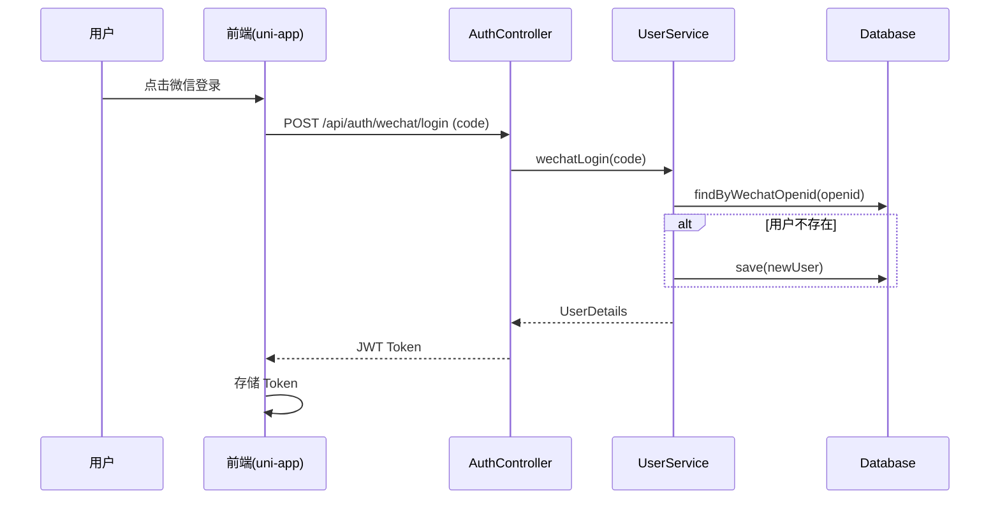
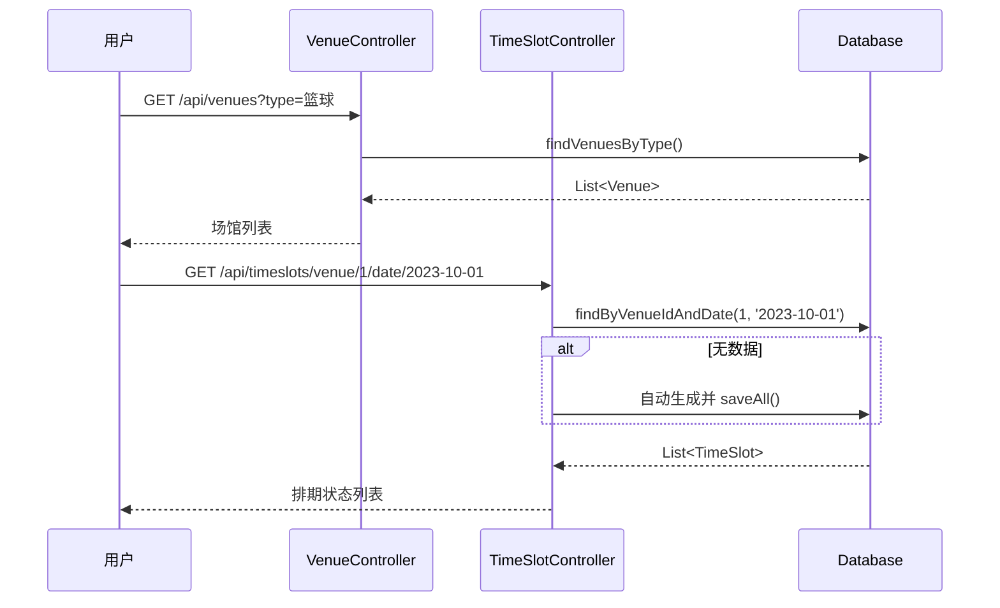
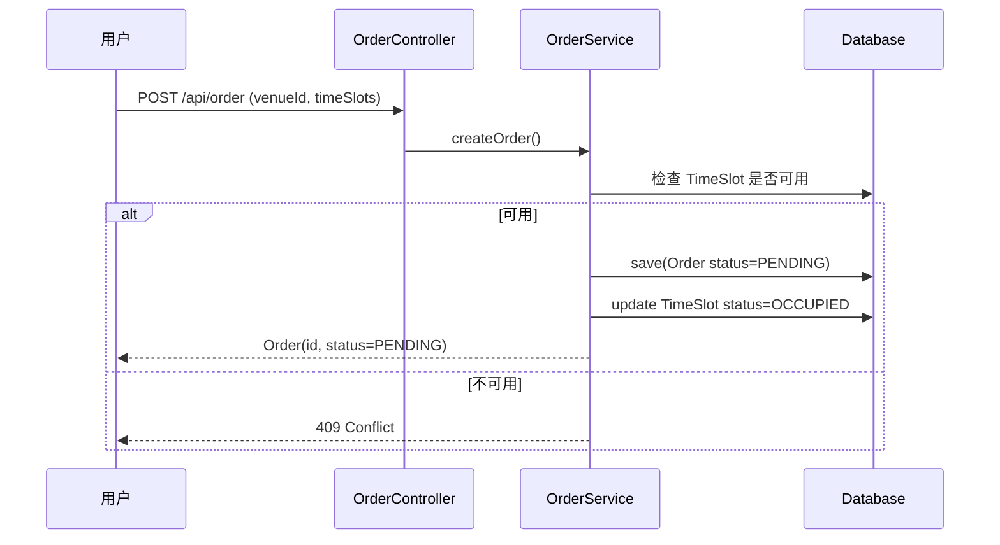
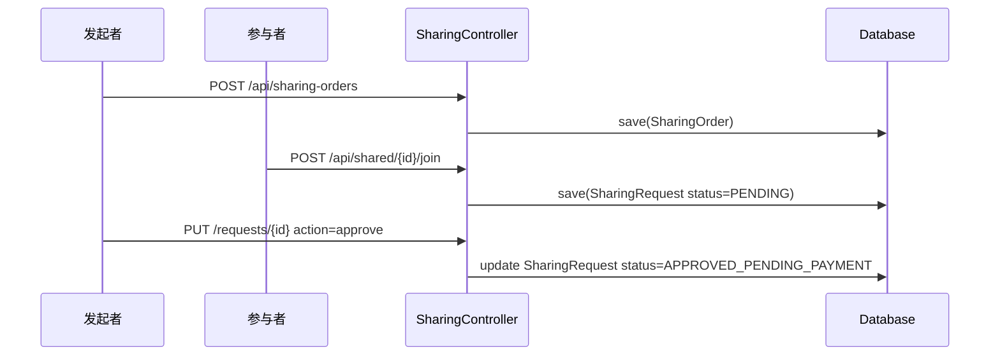
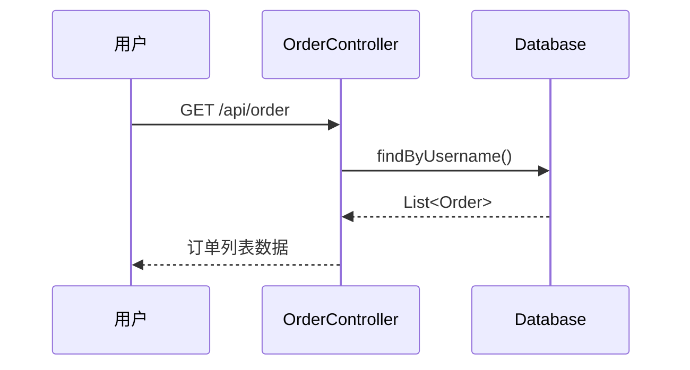
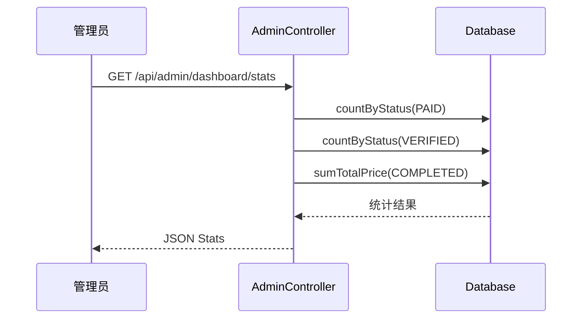
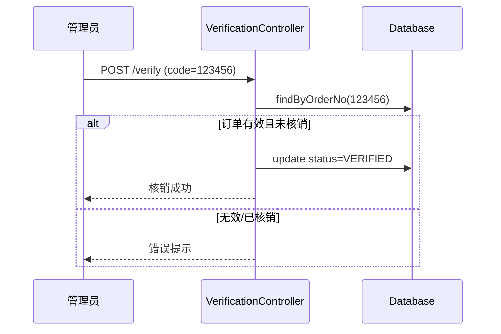
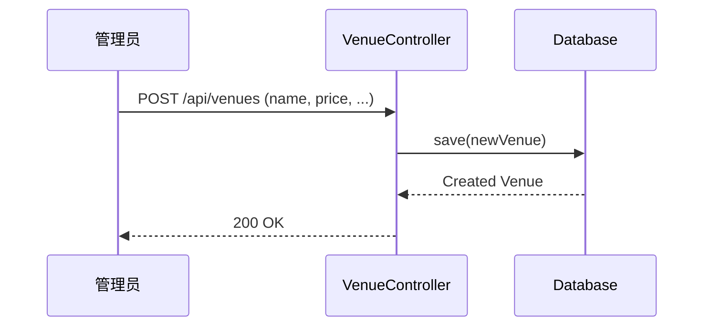
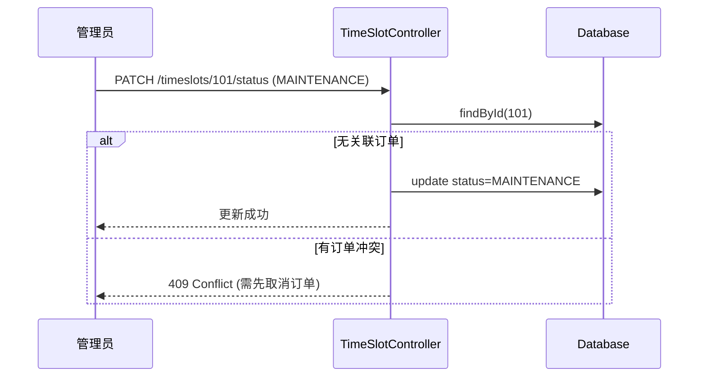
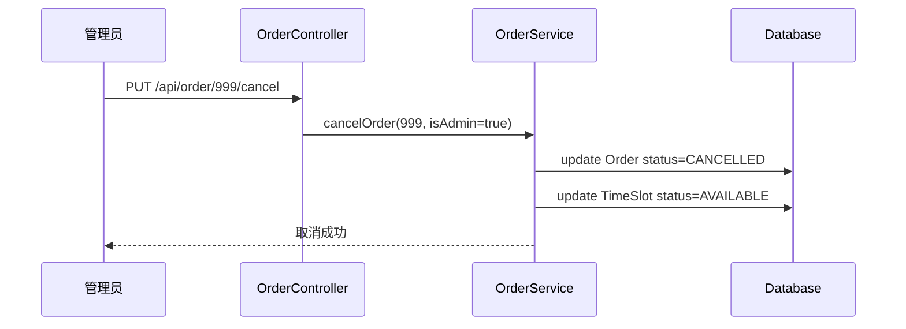

# 系统功能模块技术分析报告

本文档详细分析了系统中 10 个核心功能模块的流程、接口定义、数据库操作及交互时序。

## 1. 用户认证与管理模块 (User Auth & Profile)

### 1.1 流程说明
1.  用户点击“微信一键登录”按钮。
2.  前端获取微信临时登录凭证 `code`。
3.  调用后端接口换取 `openid`，若用户不存在则自动注册。
4.  后端生成 JWT Token 并返回。
5.  前端存储 Token，后续请求自动携带。

### 1.2 核心接口
*   `POST /api/auth/signin` - 账号密码登录
*   `POST /api/auth/wechat/login` - 微信小程序登录 (自动注册)
*   `GET /api/user/profile` - 获取个人信息
*   `PUT /api/user/profile` - 更新个人信息

### 1.3 数据库操作
*   **查询**: `userRepository.findByUsername(username)`, `userRepository.findByWechatOpenid(openid)`
*   **新增/更新**: `userRepository.save(user)`

### 1.5 核心业务逻辑
*   **Controller 逻辑**:
    *   `POST /signin`: 接收用户名密码，调用 `UserRepository` 校验用户是否存在，通过 `PasswordEncoder` 验证密码。验证通过后，使用 `JwtUtils` 生成 Token 并返回用户信息。
    *   `POST /wechat/login`: 接收微信 `code`，调用 `WechatAuthService` 获取 OpenID。
*   **Service 逻辑**:
    *   `WechatAuthService.getOpenidByCode`: 构造微信 API 请求 URL，发送 HTTP GET 请求至 `api.weixin.qq.com/sns/jscode2session`。解析响应 JSON，校验 `errcode`，成功则返回 `openid`，失败抛出异常。
    *   `UserDetailsServiceImpl`: 实现 Spring Security 的 `UserDetailsService` 接口，从数据库加载用户信息并转换为 `UserDetails` 对象，用于鉴权。

### 1.6 时序图

---

## 2. 场馆浏览与查询模块 (Venue Exploration)

### 2.1 流程说明
1.  用户进入场馆列表页，可按类型、价格筛选。
2.  点击卡片查看场馆详情（设施、图片）。
3.  选择日期查看实时排期状态（可用/占用）。

### 2.2 核心接口
*   `GET /api/venues` - 获取场馆列表（分页、筛选）
*   `GET /api/venues/{id}` - 获取场馆详情
*   `GET /api/timeslots/venue/{venueId}/date/{date}` - 获取指定日期的排期

### 2.3 数据库操作
*   **查询**: `venueRepository.findAll(spec, pageable)`, `timeSlotRepository.findByVenueIdAndDate(venueId, date)`

### 2.4 核心业务逻辑
*   **Controller 逻辑**:
    *   `GET /venues`: 接收分页参数 `page`, `pageSize` 及筛选条件 `type`, `status`, `minPrice`, `maxPrice`。调用 `VenueService` 获取数据，并手动封装分页响应结构（total, pages, data）。
    *   `GET /timeslots`: 接收 `venueId` 和 `date`。调用 `TimeSlotService` 获取时间段列表。如果列表为空，可能会触发自动生成逻辑（视 Service 实现而定）。
*   **Service 逻辑**:
    *   `VenueService.createVenue`: 保存场馆信息后，立即调用 `TimeSlotService.generateTimeSlotsForWeek` 自动生成未来一周的排期，确保场馆一上架即可被预约。
    *   `VenueService.updateVenue`: 如果检测到营业时间 (`openTime`/`closeTime`) 或价格 (`price`) 发生变更，会触发 `syncTimeSlotsAfterBusinessHoursChange`，同步更新未来未被预约的时间段配置，保证数据一致性。
    *   `TimeSlotService.getTimeSlotsByVenueAndDate`: 查询数据库中指定日期的排期。如果为空且日期非过去时间，则调用 `generateTimeSlotsForVenue` 按半小时粒度自动生成该日的排期数据并入库。

### 2.5 时序图

---

## 3. 场地包场预约模块 (Exclusive Booking)

### 3.1 流程说明
1.  用户选择空闲时间段，提交订单。
2.  系统锁定时间段（状态改为 `LOCKED` 或关联订单），生成待支付订单。
3.  用户调用支付接口完成支付。
4.  订单状态变更为 `PAID`，时间段状态变更为 `BOOKED`。

### 3.2 核心接口
*   `POST /api/order` - 提交订单
*   `POST /api/payment/pay` - 模拟支付
*   `PUT /api/order/{id}/cancel` - 取消订单

### 3.3 数据库操作
*   **事务操作**:
    1.  `timeSlotRepository.save(slot)` (更新状态为占用)
    2.  `orderRepository.save(order)` (创建订单)

### 3.4 核心业务逻辑
*   **Controller 逻辑**:
    *   `POST /order`: 接收 `Order` 对象。调用 `OrderRepository.save()` 保存订单。注意：实际业务中通常会先检查时间段可用性，但在 `OrderController` 的简单实现中可能依赖数据库约束或前端预检。
    *   `PUT /cancel`: 检查订单状态是否为终态（CANCELLED/COMPLETED/EXPIRED），若不是则更新状态为 `CANCELLED`。
*   **Service 逻辑**:
    *   `OrderStatusService.transitionOrderStatus`: 封装了状态机的核心流转逻辑。在状态变更成功后，会触发 `handleStatusTransitionSideEffects` 副作用处理：
        *   如果是拼场订单，同步更新 `SharingOrder` 状态。
        *   如果是取消或过期 (`CANCELLED`/`EXPIRED`)，调用 `timeSlotService.cancelBooking` 释放关联的时间段资源（将 TimeSlot 状态重置为 `AVAILABLE`，清空 `orderId`），并通过 WebSocket 发送通知。
    *   `TimeSlotService.bookTimeSlots` (隐式调用): 在创建订单时，需检查时间段冲突 (`hasConflict`)，锁定时间段 (`RESERVED`) 并关联 `orderId`。

### 3.5 时序图

---

## 4. 拼场社交互动模块 (Social Sharing)

### 4.1 流程说明
1.  用户 A 发起拼场，支付首份费用，生成拼场单。
2.  用户 B 浏览拼场大厅，申请加入。
3.  用户 A 审核通过。
4.  用户 B 支付份额，加入成功。

### 4.2 核心接口
*   `POST /api/sharing-orders` - 发起拼场
*   `POST /api/shared/{id}/join` - 申请加入
*   `PUT /api/shared/requests/{requestId}` - 审核申请 (approve/reject)

### 4.3 数据库操作
*   **关联查询**: `sharingOrderRepository`, `sharingRequestRepository`
*   **状态流转**: 更新 `SharingRequest` 状态及 `SharingOrder` 的 `currentParticipants`

### 4.4 核心业务逻辑
*   **Controller 逻辑**:
    *   `PUT /requests/{requestId}` (handleSharingRequest): 处理拼场申请。
        *   权限校验：确保当前用户是拼场发起人。
        *   **Approve 逻辑**: 检查发起人是否已支付（状态必须为 `OPEN`）。如果批准，设置申请状态为 `APPROVED_PENDING_PAYMENT`，生成 `paymentDeadline` (30分钟后) 和 `paymentOrderNo`，并计算需支付金额（通常为 `pricePerTeam`）。更新主订单状态为 `APPROVED_PENDING_PAYMENT` 以阻塞其他操作。
        *   **Reject 逻辑**: 直接将申请状态设为 `REJECTED`。
*   **Service 逻辑**:
    *   `SharingOrderService.createSharingOrder`: 创建拼场单。
        *   校验场馆是否支持拼场（仅篮球/足球）。
        *   校验时间限制（必须在开场3小时前发起）。
        *   校验冲突：检查时间段是否已被预约或已有重叠拼场单。
        *   如果关联了主订单 (`orderId`)，会自动同步主订单的时间 (`bookingTime`) 和计算价格（总价的一半作为每队费用）。
    *   `OrderStatusService`: 当主订单状态流转时（如 `SHARING_SUCCESS`），自动同步更新 `SharingOrder` 的状态。

### 4.5 时序图

---

## 5. 订单与凭证管理模块 (Order & Voucher)

### 5.1 流程说明
1.  用户查看“我的订单”。
2.  已支付订单展示核销码（`orderNo` 或专用 `verificationCode`）。
3.  用户凭码入场。

### 5.2 核心接口
*   `GET /api/order?username={xxx}` - 获取我的订单
*   `GET /api/order/{id}` - 获取订单详情（含核销码）

### 5.3 数据库操作
*   **查询**: `orderRepository.findByUsername(username)`

### 5.4 核心业务逻辑
*   **Controller 逻辑**:
    *   `GET /order/{id}`: 直接调用 `OrderRepository.findById`。为了安全性，通常需要校验当前用户是否为订单所有者（`order.username.equals(currentUser)`）。返回的订单对象中包含 `orderNo`，前端将其渲染为二维码或条形码作为核销凭证。
    *   `GET /order`: 根据用户名查询历史订单列表，按创建时间倒序排列。
*   **Service 逻辑**:
    *   `OrderService`: 提供了基础的 `getOrderById` 和 `saveOrder` 方法。主要业务逻辑集中在 `OrderStatusService` 中处理状态变更。
    *   `OrderStatusService.processExpiredPaymentOrders` (定时任务): 扫描 `PENDING` 状态且创建超过24小时的订单，自动执行过期处理 (`EXPIRED`)，释放资源。

### 5.5 时序图

---

## 6. 管理员工作台模块 (Admin Dashboard)

### 6.1 流程说明
1.  管理员登录后进入工作台。
2.  系统聚合今日订单、营收、待核销数。
3.  返回统计数据供前端图表展示。

### 6.2 核心接口
*   `GET /api/admin/dashboard/stats` - 获取仪表盘统计数据

### 6.3 数据库操作
*   **聚合查询**: `orderRepository.countBy...`, `orderRepository.sumTotalPrice...`

### 6.4 核心业务逻辑
*   **Controller 逻辑**:
    *   `GET /dashboard/stats`: 接收时间范围参数 (`today`, `week`, `month`)。
        *   计算时间窗口 (`rangeStart`, `rangeEnd`)。
        *   调用 `OrderRepository` 的聚合查询方法统计数据。
        *   统计维度包括：总订单数 (`totalOrders`)、待核销数 (`pendingVerification`)、已核销数 (`verified`)、总营收 (`revenue`) 等。
        *   特别处理：如果管理员未管理任何场馆，直接返回零数据。
*   **Service 逻辑**:
    *   主要依赖 `OrderRepository` 的自定义 JPQL 查询接口，如 `countByVenueIdInAndStatusIn...` 和 `sumTotalPrice...`，在数据库层面完成聚合计算，减少内存开销。

### 6.5 时序图

---

## 7. 现场核销验证模块 (On-site Verification)

### 7.1 流程说明
1.  管理员输入用户展示的核销码。
2.  系统校验订单有效性（是否存在、状态是否为 PAID/CONFIRMED）。
3.  验证通过后，更新订单状态为 `VERIFIED`。

### 7.2 核心接口
*   `GET /api/verification/code/{code}` - 查询核销码对应订单
*   `POST /api/verification/code/verify` - 执行核销

### 7.3 数据库操作
*   **查询**: `orderRepository.findByOrderNo(code)`
*   **更新**: `order.setStatus(VERIFIED); orderRepository.save(order)`

### 7.4 核心业务逻辑
*   **Controller 逻辑**:
    *   `GET /code/{code}`: 根据核销码查询订单。校验当前管理员是否管理该订单所属的场馆（权限隔离）。
    *   `POST /code/verify`: 执行核销。
        *   解析核销码，获取订单实体。
        *   再次校验管理员权限。
        *   **状态校验**: 只有 `CONFIRMED` (已确认)、`PAID` (已支付) 或 `SHARING_SUCCESS` (拼场成功) 的订单才允许核销。
        *   更新状态为 `VERIFIED`，记录核销人 (`verifiedBy`) 和核销时间。
    *   `POST /orders/{id}/complete`: 核销后的“完成”操作。将 `VERIFIED` 状态流转为 `COMPLETED`，标志服务结束。
*   **Service 逻辑**:
    *   该模块逻辑主要集中在 `VerificationController` 中，直接编排 `OrderRepository` 和权限校验逻辑。

### 7.5 时序图

---

## 8. 场馆资源管理模块 (Venue Resource)

### 8.1 流程说明
1.  管理员新增或编辑场馆信息（价格、图片、营业时间）。
2.  管理员控制场馆上下架状态。

### 8.2 核心接口
*   `POST /api/venues` - 新增场馆
*   `PUT /api/venues/{id}` - 更新场馆
*   `PATCH /api/venues/{id}/status` - 更新状态

### 8.3 数据库操作
*   **增改**: `venueRepository.save(venue)`

### 8.4 核心业务逻辑
*   **Controller 逻辑**:
    *   `POST /venues`: 接收场馆信息，调用 `VenueService.createVenue`。
    *   `PUT /venues/{id}`: 接收更新信息，调用 `VenueService.updateVenue`。
*   **Service 逻辑**:
    *   `VenueService.createVenue`: 保存场馆后，触发 `TimeSlotService.generateTimeSlotsForWeek`，自动初始化未来7天的库存。默认根据场馆类型（足球/篮球）设置 `supportSharing` 属性。
    *   `VenueService.updateVenue`: 保存变更后，判断关键属性（营业时间 `openTime`/`closeTime` 或价格 `price`）是否变化。如果变化，调用 `syncTimeSlotsAfterBusinessHoursChange`，遍历未来日期，对**无预约**的日期执行“删除旧时段 -> 生成新时段”的同步操作，确保库存数据与场馆配置一致。

### 8.5 时序图

---

## 9. 排期与库存控制模块 (Schedule Control)

### 9.1 流程说明
1.  管理员查看排期表。
2.  点击特定时间段，选择“设为维护”或“锁定”。
3.  系统更新 `TimeSlot` 状态，阻止用户预约。

### 9.2 核心接口
*   `PATCH /api/timeslots/{id}/status` - 更新时间段状态

### 9.3 数据库操作
*   **更新**: `timeSlotRepository.save(slot)`
*   **冲突检查**: 检查该时间段是否已有有效订单关联。

### 9.4 核心业务逻辑
*   **Controller 逻辑**:
    *   `PATCH /timeslots/{id}/status`: 管理员手动更新时间段状态。
        *   校验管理员对该场馆的管理权限。
        *   **冲突检测**: 如果试图将状态设为 `MAINTENANCE` (维护)，必须检查该时间段是否已被占用（`orderId != null` 或状态为 `RESERVED`/`BOOKED` 等）。如果有冲突，拒绝操作并返回 409。
*   **Service 逻辑**:
    *   `TimeSlotService.updateTimeSlotStatus`: 执行实际的数据库更新操作。
    *   `TimeSlotService.generateTimeSlotsForVenue`: 核心库存生成逻辑。按每30分钟一个粒度，从 `openTime` 到 `closeTime` 循环创建 `TimeSlot` 记录，并计算该时段价格（通常为每小时价格的一半）。

### 9.5 时序图

---

## 10. 全系统订单监管模块 (Order Oversight)

### 10.1 流程说明
1.  管理员检索历史订单（按状态、用户）。
2.  发现异常订单（如违规占场），点击“强制取消”。
3.  系统执行退款逻辑（模拟），并释放关联的 `TimeSlot`。

### 10.2 核心接口
*   `GET /api/order/all` - 获取所有订单
*   `PUT /api/order/{id}/cancel` - 强制取消

### 10.3 数据库操作
*   **更新订单**: `order.setStatus(CANCELLED)`
*   **释放资源**: `timeSlot.setStatus(AVAILABLE); timeSlot.setOrderId(null)`

### 10.4 核心业务逻辑
*   **Controller 逻辑**:
    *   `PUT /order/{id}/cancel`: 复用订单取消接口。管理员调用时，通常不受用户端“提前2小时取消”的规则限制（需在 Service 层区分角色或在 Controller 层通过权限注解控制）。
*   **Service 逻辑**:
    *   `OrderStatusService.processBookingExpiredOrders` (定时任务): 每天凌晨扫描预约时间已过但状态仍为 `PAID`/`CONFIRMED` 的订单，将其标记为 `COMPLETED` 或 `EXPIRED`（视业务规则而定，通常视为已履约）。
    *   `OrderStatusService.transitionOrderStatus`: 所有的取消操作最终都收口于此。当管理员强制取消订单时，触发 `releaseTimeSlots`，通过 `TimeSlotService` 将关联的时间段状态重置为 `AVAILABLE`，确保场地可被重新预订。

### 10.5 时序图

