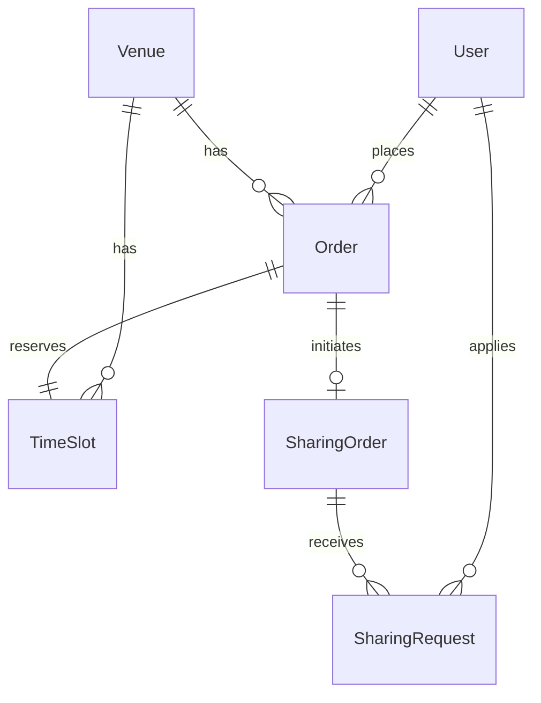
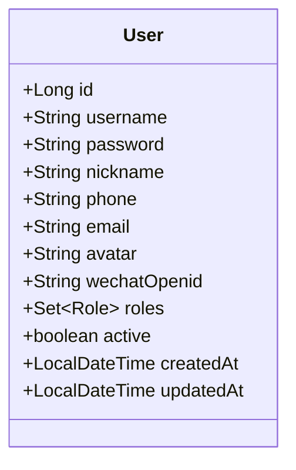
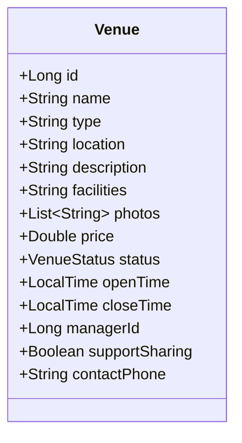
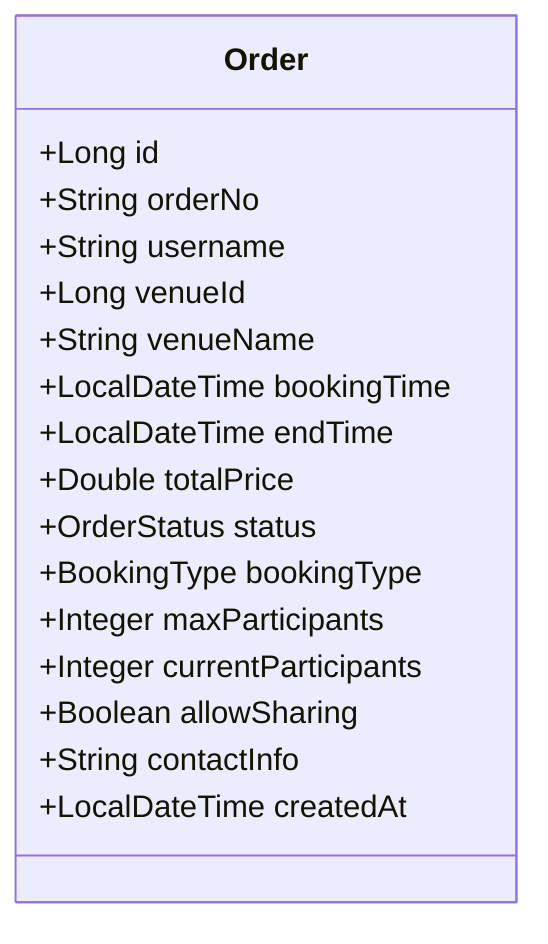
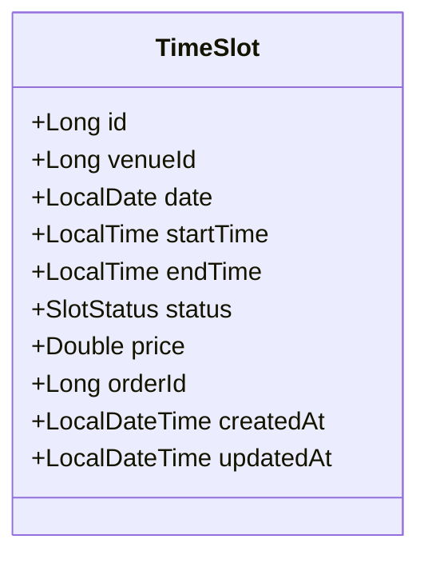
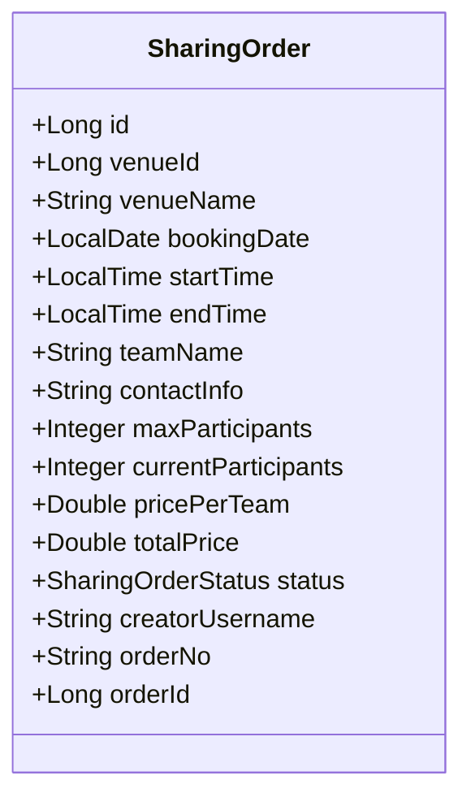
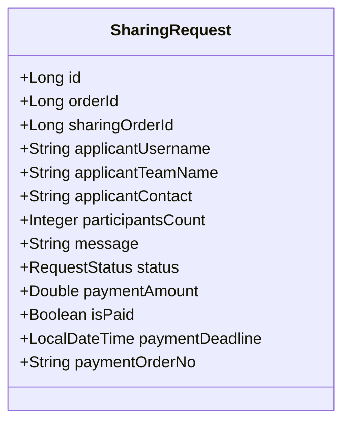

# 系统实体分析报告 (System Entity Analysis)

## 1. 核心实体概述

系统包含 6 个核心业务实体，构成了完整的体育馆预约与拼场生态：

1.  **User (用户)**: 系统的参与者（普通用户、管理员）。
2.  **Venue (场馆)**: 可供预约的物理资源。
3.  **Order (订单)**: 基础交易记录，关联用户与场馆时间。
4.  **TimeSlot (时间段)**: 场馆的库存单元。
5.  **SharingOrder (拼场单)**: 基于基础订单衍生的社交招募单。
6.  **SharingRequest (拼场申请)**: 用户参与拼场的请求记录。

---

## 2. 实体详细分析

### 2.1 User (用户)
*   **描述**: 系统的账户实体，存储身份认证与权限信息。
*   **主键**: `id` (Long)
*   **核心字段**:
    *   `username` (String, Unique): 登录账号
    *   `password` (String): 加密密码
    *   `wechatOpenid` (String, Unique): 微信唯一标识
    *   `roles` (Set<Role>): 角色集合 (ROLE_USER, ROLE_VENUE_ADMIN等)
    *   `phone`, `email`, `nickname`, `avatar`
*   **关系**:
    *   **1:N** `Order` (一个用户可创建多个订单)
    *   **1:N** `Venue` (一个管理员可管理多个场馆，通过 `managerId` 逻辑关联)

### 2.2 Venue (场馆)
*   **描述**: 体育馆资源实体，包含场地基本信息与状态。
*   **主键**: `id` (Long)
*   **核心字段**:
    *   `name` (String): 场馆名称
    *   `type` (String): 运动类型 (篮球/足球等)
    *   `price` (Double): 基础价格
    *   `status` (Enum): 状态 (OPEN/CLOSED/MAINTENANCE)
    *   `managerId` (Long): 管理员ID
    *   `supportSharing` (Boolean): 是否支持拼场
*   **关系**:
    *   **1:N** `TimeSlot` (拥有多个排期时间段)
    *   **1:N** `Order` (产生多个预约订单)

### 2.3 Order (订单)
*   **描述**: 用户预约场地的交易记录，是系统的核心流转单据。
*   **主键**: `id` (Long)
*   **核心字段**:
    *   `orderNo` (String, Unique): 业务订单号
    *   `username` (String): 下单用户名
    *   `venueId` (Long): 场馆ID
    *   `status` (Enum): 订单状态 (PENDING, PAID, VERIFIED, etc.)
    *   `bookingType` (Enum): 预约类型 (EXCLUSIVE-包场 / SHARED-拼场)
    *   `totalPrice` (Double): 订单总金额
*   **关系**:
    *   **N:1** `User` (归属于某个用户)
    *   **N:1** `Venue` (归属于某个场馆)
    *   **1:1** `SharingOrder` (若是拼场类型，对应一个拼场招募单)

### 2.4 TimeSlot (时间段/库存)
*   **描述**: 场馆在特定日期的最小可预约单元（库存）。
*   **主键**: `id` (Long)
*   **核心字段**:
    *   `venueId` (Long): 关联场馆
    *   `date` (LocalDate): 日期
    *   `startTime`, `endTime` (LocalTime): 起止时间
    *   `status` (Enum): 状态 (AVAILABLE, BOOKED, MAINTENANCE, etc.)
    *   `orderId` (Long): 占用该时间段的订单ID
*   **关系**:
    *   **N:1** `Venue`
    *   **1:1** `Order` (被某个订单锁定)

### 2.5 SharingOrder (拼场单)
*   **描述**: 基于基础订单发起的拼场招募活动实体。
*   **主键**: `id` (Long)
*   **核心字段**:
    *   `orderId` (Long): 关联的基础订单ID
    *   `creatorUsername` (String): 发起人
    *   `maxParticipants` (Integer): 最大人数
    *   `currentParticipants` (Integer): 当前人数
    *   `pricePerTeam` (Double): 每队/每人费用
    *   `status` (Enum): 拼场状态 (OPEN, FULL, CONFIRMED)
*   **关系**:
    *   **1:1** `Order` (依附于基础订单)
    *   **1:N** `SharingRequest` (接收多个加入申请)

### 2.6 SharingRequest (拼场申请)
*   **描述**: 用户申请加入某个拼场活动的记录。
*   **主键**: `id` (Long)
*   **核心字段**:
    *   `sharingOrderId` (Long): 目标拼场单ID
    *   `applicantUsername` (String): 申请人
    *   `status` (Enum): 申请状态 (PENDING, APPROVED, PAID, REJECTED)
    *   `paymentAmount` (Double): 需支付金额
    *   `isPaid` (Boolean): 是否已支付
*   **关系**:
    *   **N:1** `SharingOrder`
    *   **N:1** `User` (申请人)

---

## 3. 核心实体识别

系统的**核心实体 (Core Entities)** 为：

1.  **Order (订单)**: 连接用户、场馆与支付的核心枢纽，承载了系统的主要业务价值。
2.  **Venue (场馆)**: 系统的核心资源对象，所有业务围绕其展开。
3.  **TimeSlot (时间段)**: 库存管理的核心，决定了资源的可用性与并发控制。
4.  **SharingOrder (拼场单)**: 社交属性的核心载体，实现了多人共享资源的业务逻辑。

---

## 4. 实体关系图 (ER Diagram)

### 4.1 全局关系图

### 4.2 独立实体图

#### User (用户)

#### Venue (场馆)

#### Order (订单)

#### TimeSlot (时间段/库存)

#### SharingOrder (拼场单)

#### SharingRequest (拼场申请)

